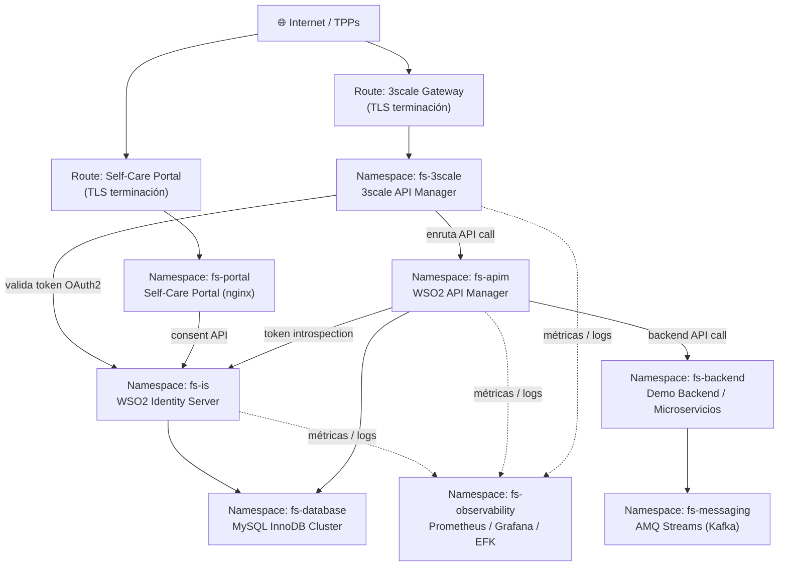
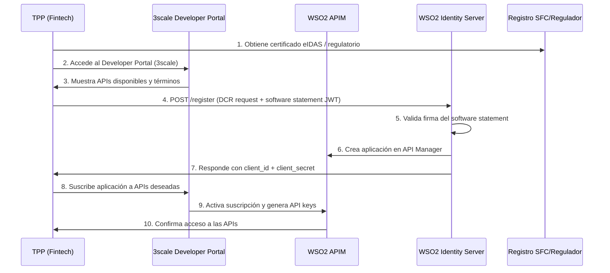
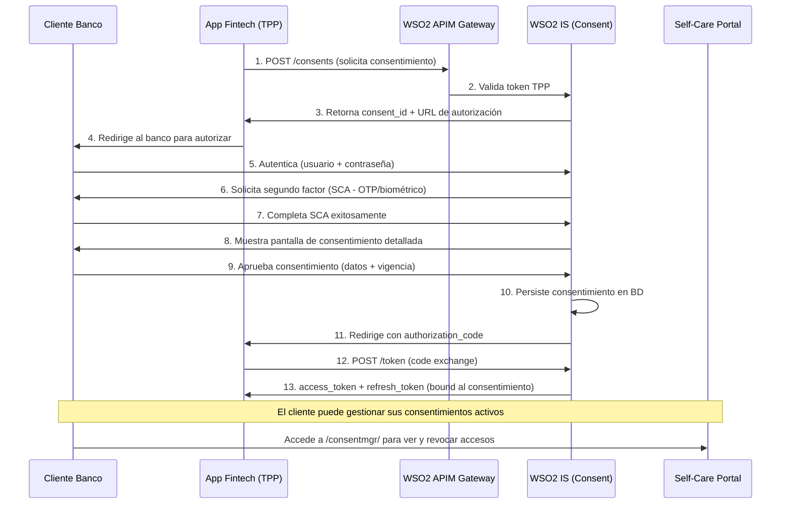
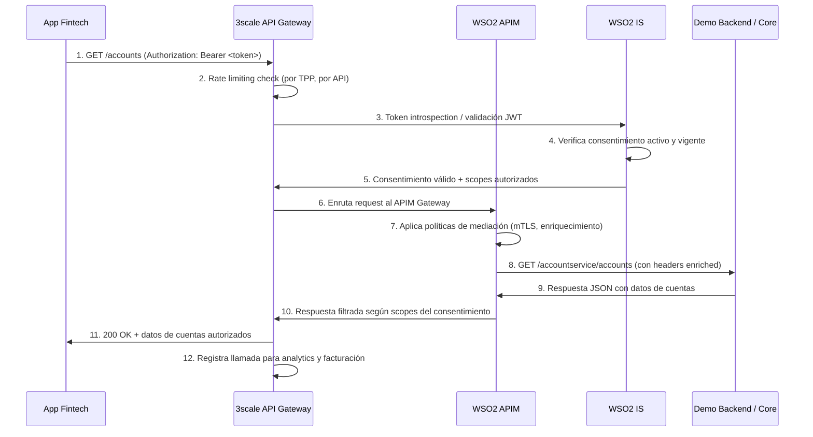
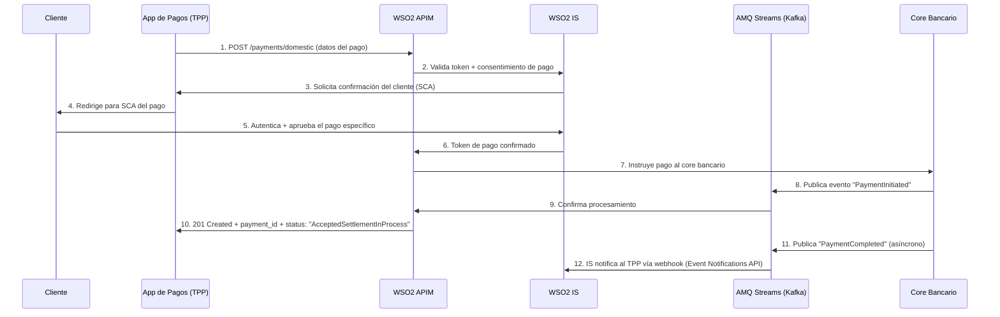

# Documento de Arquitectura — Open Banking sobre Red Hat OpenShift

| Campo | Valor |
|---|---|
| **Proyecto** | Implementación Open Banking — Servicios Financieros |
| **Versión** | 1.0.0 |
| **Fecha** | 2026-06-25 |
| **Estado** | Borrador para revisión |
| **Autor** | Juan Pablo Garzon |
| **Revisor** | Ronald Lopez |
| **Clasificación** | Confidencial |

---

## Tabla de Contenidos

1. [Introducción y Alcance](#1-introducción-y-alcance)
2. [Contexto Regulatorio](#2-contexto-regulatorio)
3. [Arquitectura de Referencia](#3-arquitectura-de-referencia)
   - 3.1 [Vista de Componentes](#31-vista-de-componentes)
   - 3.2 [Vista de Despliegue — OCP](#32-vista-de-despliegue--ocp)
   - 3.3 [Vista de Seguridad](#33-vista-de-seguridad)
   - 3.4 [Vista de Integración — Core Bancario](#34-vista-de-integración--core-bancario)
4. [Flujos Principales](#4-flujos-principales)
   - 4.1 [Registro de TPP](#41-registro-de-tpp-dynamic-client-registration)
   - 4.2 [Consentimiento de Cliente](#42-consentimiento-de-cliente)
   - 4.3 [Consumo de API — Cuentas](#43-consumo-de-api--cuentas)
   - 4.4 [Iniciación de Pago](#44-iniciación-de-pago)
5. [Requisitos No Funcionales](#5-requisitos-no-funcionales)
6. [Decisiones Arquitectónicas (ADRs)](#6-decisiones-arquitectónicas-adrs)
7. [Plan de Migración y Roadmap](#7-plan-de-migración-y-roadmap)
8. [Glosario](#8-glosario)

---

## 1. Introducción y Alcance

### 1.1 Propósito

Este documento describe la arquitectura de referencia para la implementación de **Open Banking** sobre **Red Hat OpenShift Container Platform (OCP)**, usando **WSO2 Financial Services Accelerator 4.1.2** como capa de cumplimiento normativo.

El objetivo es habilitar la exposición segura y regulada de APIs bancarias a terceros proveedores de servicios de pago (TPPs) y aplicaciones fintech, cumpliendo los marcos regulatorios aplicables al sector financiero colombiano y los estándares internacionales de Open Finance.

### 1.2 Alcance

| En alcance | Fuera de alcance |
|---|---|
| Arquitectura de API Gateway con 3scale | Desarrollo de aplicaciones fintech cliente |
| Gestión de consentimientos (WSO2 IS + FS Accelerator) | Modernización del core bancario |
| Flujos OAuth2/OIDC y SCA | Integración con sistemas de pagos interbancarios (ACH) |
| Despliegue en OCP (namespaces, Deployments, Routes) | Gestión de fraude en tiempo real |
| Observabilidad y monitoreo | Procesamiento de datos para ML/IA |
| Integración con core bancario vía APIs REST | Onboarding de clientes digitales |

### 1.3 Audiencia

- Arquitectos de soluciones y software
- Equipos de DevSecOps y SRE
- Área de Cumplimiento y Seguridad
- Gerencia de TI y patrocinadores del proyecto

### 1.4 Documentos Relacionados

| Documento | Ubicación |
|---|---|
| Arquitectura de Referencia WSO2 FS | `docs/architecture/reference-architecture.md` |
| Guía de Despliegue OpenShift | `docs/architecture/deployment-openshift.md` |
| Guía de Despliegue AWS EKS | `docs/architecture/deployment-aws-eks.md` |
| Código fuente del acelerador | `financial-services-accelerator/` |

---

## 2. Contexto Regulatorio

### 2.1 Marco Regulatorio Colombia

La Superintendencia Financiera de Colombia (SFC) avanza en la regulación de **Open Finance** bajo el marco de la Circular Básica Jurídica y los decretos del Ministerio de Hacienda. Los principios fundamentales son:

- **Consentimiento explícito**: el cliente autoriza el acceso a sus datos y puede revocarlo en cualquier momento.
- **Portabilidad de datos**: las entidades deben exponer APIs estandarizadas a TPPs autorizados.
- **Seguridad**: autenticación robusta (SCA), cifrado en tránsito y en reposo.
- **Trazabilidad**: registro de accesos y operaciones con fines de auditoría.
- **Reciprocidad**: las entidades que consumen datos también los deben exponer.

### 2.2 Estándares Internacionales de Referencia

| Estándar | Aplicación en este proyecto |
|---|---|
| **PSD2 (Europa)** | Modelo de referencia para consentimientos, SCA y DCR |
| **Open Banking UK (OBIE)** | Especificación de APIs: cuentas, pagos, fondos |
| **FAPI 1.0 Advanced** | Perfil de seguridad OAuth2/OIDC para servicios financieros |
| **ISO 20022** | Mensajería estandarizada para pagos |
| **OpenID Connect** | Autenticación federada de identidades |

### 2.3 Obligaciones Técnicas

```
┌─────────────────────────────────────────────────────────────────┐
│  Obligación                          │ Componente responsable    │
├─────────────────────────────────────────────────────────────────┤
│  Autenticación fuerte (SCA)          │ WSO2 IS + FS Accelerator  │
│  Consentimiento granular y revocable │ Consent Management API    │
│  Registro dinámico de TPPs (DCR)     │ WSO2 IS + 3scale          │
│  Rate limiting por TPP               │ 3scale API Management     │
│  Logs de auditoría (5 años)          │ EFK Stack + SIEM          │
│  Cifrado TLS 1.2+ obligatorio        │ OCP / Service Mesh        │
│  SLA APIs < 2 segundos               │ OCP HPA + API Gateway     │
└─────────────────────────────────────────────────────────────────┘
```

---

## 3. Arquitectura de Referencia

### 3.1 Vista de Componentes

```
┌──────────────────────────────────────────────────────────────────────┐
│                        CAPA DE CLIENTE                               │
│   Aplicación Móvil / Web    │    Fintech / TPP (tercero)             │
└────────────────┬─────────────────────────────┬───────────────────────┘
                 │                             │
                 ▼                             ▼
┌──────────────────────────────────────────────────────────────────────┐
│                   CAPA DE API MANAGEMENT                             │
│                                                                      │
│   ┌──────────────────────────────────────────────────────────────┐  │
│   │          Red Hat 3scale API Management                       │  │
│   │  • Developer Portal (self-service TPP onboarding)            │  │
│   │  • API Gateway (rate limiting, auth, transformaciones)       │  │
│   │  • Admin Portal (métricas, facturación, versiones)           │  │
│   │  • ActiveDocs (especificación OpenAPI de las APIs)           │  │
│   └──────────────────────────────────────────────────────────────┘  │
└────────────────┬─────────────────────────────────────────────────────┘
                 │
                 ▼
┌──────────────────────────────────────────────────────────────────────┐
│              CAPA DE IDENTIDAD Y CONSENTIMIENTO                      │
│                                                                      │
│   ┌─────────────────────────┐   ┌──────────────────────────────┐    │
│   │  Red Hat SSO (Keycloak) │   │  WSO2 Identity Server 7.1    │    │
│   │  • Federación IdP       │   │  • FS IS Accelerator 4.1.2   │    │
│   │  • SCA / MFA            │   │  • Consent Management API    │    │
│   │  • Sesiones bancarias   │   │  • Auth Endpoint             │    │
│   │  • JWKS endpoint        │   │  • DCR / Key Manager         │    │
│   └─────────────────────────┘   │  • Event Notifications       │    │
│                                 └──────────────────────────────┘    │
│                                                                      │
│   ┌──────────────────────────────────────────────────────────────┐  │
│   │  Self-Care Portal (React SPA — nginx)                        │  │
│   │  • Gestión de consentimientos por el cliente                 │  │
│   │  • Visualización de accesos activos                          │  │
│   │  • Revocación de accesos                                     │  │
│   └──────────────────────────────────────────────────────────────┘  │
└────────────────┬─────────────────────────────────────────────────────┘
                 │
                 ▼
┌──────────────────────────────────────────────────────────────────────┐
│                  CAPA DE APIs DE NEGOCIO                             │
│                                                                      │
│   ┌──────────────────┐  ┌──────────────────┐  ┌─────────────────┐  │
│   │  WSO2 API Manager│  │  Demo Backend     │  │  Microservicios │  │
│   │  4.3.0 + FS APIM │  │  (mock bancario)  │  │  (futuros)      │  │
│   │  Accelerator     │  │  • Accounts API   │  │  • Pagos        │  │
│   │  • Gateway APIM  │  │  • Payments API   │  │  • Créditos     │  │
│   │  • Mediation     │  │  • VRP API        │  │  • Seguros      │  │
│   │  • mTLS enforce  │  │  • FundsConf API  │  │                 │  │
│   └──────────────────┘  └──────────────────┘  └─────────────────┘  │
└────────────────┬─────────────────────────────────────────────────────┘
                 │
                 ▼
┌──────────────────────────────────────────────────────────────────────┐
│                    CAPA DE DATOS Y EVENTOS                           │
│                                                                      │
│   ┌────────────────────┐   ┌─────────────────────────────────────┐  │
│   │  Bases de datos     │   │  AMQ Streams (Kafka)                │  │
│   │  • MySQL (consent)  │   │  • Notificaciones de eventos        │  │
│   │  • MySQL (APIM)     │   │  • Pagos en tiempo real             │  │
│   │  • MySQL (IS)       │   │  • Audit trail streaming            │  │
│   └────────────────────┘   └─────────────────────────────────────┘  │
└──────────────────────────────────────────────────────────────────────┘
                 │
                 ▼
┌──────────────────────────────────────────────────────────────────────┐
│                   CAPA DE OBSERVABILIDAD                             │
│   Prometheus + Grafana │ EFK Stack │ Jaeger (tracing) │ AlertManager │
└──────────────────────────────────────────────────────────────────────┘
```

### 3.2 Vista de Despliegue — OCP

```
Red Hat OpenShift Container Platform 4.14+
│
├── Namespace: fs-apim
│   ├── Deployment: wso2-apim (3 réplicas)
│   ├── Service: wso2-apim-svc (ClusterIP)
│   ├── Route: apim.apps.<cluster-domain>  (HTTPS)
│   ├── Route: gateway.apps.<cluster-domain> (HTTPS)
│   ├── ConfigMap: apim-config
│   ├── Secret: apim-keystore
│   └── PVC: apim-storage (10Gi)
│
├── Namespace: fs-is
│   ├── Deployment: wso2-is (2 réplicas)
│   ├── Deployment: consent-mgt-endpoint
│   ├── Deployment: event-notifications-endpoint
│   ├── Deployment: authentication-endpoint
│   ├── Service: wso2-is-svc (ClusterIP)
│   ├── Route: is.apps.<cluster-domain> (HTTPS)
│   ├── ConfigMap: is-config
│   ├── Secret: is-keystore
│   └── PVC: is-storage (10Gi)
│
├── Namespace: fs-portal
│   ├── Deployment: self-care-portal (2 réplicas, nginx)
│   ├── Service: portal-svc (ClusterIP)
│   └── Route: portal.apps.<cluster-domain> (HTTPS)
│
├── Namespace: fs-backend
│   ├── Deployment: demo-backend (Tomcat, 2 réplicas)
│   ├── Service: demo-backend-svc (ClusterIP)
│   └── Route: backend.apps.<cluster-domain> (HTTPS)
│
├── Namespace: fs-database
│   ├── StatefulSet: mysql (3 nodos — InnoDB Cluster)
│   ├── Service: mysql-svc (ClusterIP)
│   └── PVC: mysql-data-* (50Gi cada uno)
│
├── Namespace: fs-messaging
│   ├── Kafka: amq-streams-cluster (3 brokers, 3 zookeepers)
│   └── KafkaTopic: consent-events, payment-events, audit-events
│
├── Namespace: fs-3scale
│   ├── APIManager: apimanager (operador 3scale)
│   ├── Route: admin.apps.<cluster-domain>
│   ├── Route: developer.apps.<cluster-domain>
│   └── Secret: 3scale-system-seed
│
└── Namespace: fs-observability
    ├── Prometheus (vía OpenShift Monitoring)
    ├── Grafana
    ├── Elasticsearch + Fluentd + Kibana (EFK)
    └── Jaeger (distributed tracing)
```

**Diagrama de red y comunicación entre namespaces:**



### 3.3 Vista de Seguridad

```
┌─────────────────────────────────────────────────────────────────────┐
│                     CONTROLES DE SEGURIDAD                          │
├─────────────────────────────────────────────────────────────────────┤
│                                                                      │
│  Perímetro externo                                                   │
│  ┌──────────────────────────────────────────────────────────────┐   │
│  │  • TLS 1.2+ obligatorio en todos los Routes de OCP           │   │
│  │  • Certificados X.509 emitidos por CA del banco o Let's Enc. │   │
│  │  • WAF (Web Application Firewall) — opcional por OCP Ingress │   │
│  │  • Rate limiting por IP y por TPP (3scale policies)          │   │
│  └──────────────────────────────────────────────────────────────┘   │
│                                                                      │
│  Autenticación y autorización                                        │
│  ┌──────────────────────────────────────────────────────────────┐   │
│  │  • OAuth2 Authorization Code Flow + PKCE (clientes públicos) │   │
│  │  • FAPI 1.0 Advanced (mTLS + request objects firmados)       │   │
│  │  • SCA: segundo factor requerido para consentimientos        │   │
│  │  • RBAC en OCP (ServiceAccounts con mínimo privilegio)       │   │
│  │  • Network Policies: deny-all por defecto entre namespaces   │   │
│  └──────────────────────────────────────────────────────────────┘   │
│                                                                      │
│  Comunicación interna                                                │
│  ┌──────────────────────────────────────────────────────────────┐   │
│  │  • mTLS entre microservicios vía Red Hat Service Mesh (Istio)│   │
│  │  • Secrets cifrados (OCP Secrets + SealedSecrets o Vault)    │   │
│  │  • Imágenes base de Red Hat (UBI — Universal Base Image)     │   │
│  │  • Escaneo de vulnerabilidades: Red Hat Quay / ACS           │   │
│  └──────────────────────────────────────────────────────────────┘   │
│                                                                      │
│  Datos                                                               │
│  ┌──────────────────────────────────────────────────────────────┐   │
│  │  • Cifrado en reposo: OCP etcd cifrado + MySQL TDE           │   │
│  │  • PII enmascarados en logs                                  │   │
│  │  • Retención de logs de auditoría: mínimo 5 años             │   │
│  │  • Backups cifrados de BD con RPO < 1h                       │   │
│  └──────────────────────────────────────────────────────────────┘   │
│                                                                      │
└─────────────────────────────────────────────────────────────────────┘
```

**Matriz de acceso entre componentes:**

| Origen | Destino | Protocolo | Puerto | Autenticación |
|---|---|---|---|---|
| TPP externo | 3scale Gateway | HTTPS | 443 | mTLS + OAuth2 token |
| 3scale | WSO2 APIM | HTTPS | 8243 | JWT (interno) |
| 3scale | WSO2 IS | HTTPS | 9443 | OAuth2 introspection |
| WSO2 APIM | Demo Backend | HTTP | 8080 | JWT header |
| WSO2 IS | MySQL | TCP | 3306 | User/Pass (Secret OCP) |
| WSO2 APIM | MySQL | TCP | 3306 | User/Pass (Secret OCP) |
| Self-Care Portal | WSO2 IS | HTTPS | 9443 | OAuth2 session cookie |
| Todos | Prometheus | HTTP | 9090 | ServiceAccount token |

### 3.4 Vista de Integración — Core Bancario

```
                    ┌────────────────────────────────┐
                    │      Core Bancario             │
                    │  (Sistema legado / mainframe)  │
                    └───────────────┬────────────────┘
                                    │
              ┌─────────────────────▼──────────────────────┐
              │         Capa de Integración                │
              │                                            │
              │  Opción A: API REST directa                │
              │  ┌────────────────────────────────────┐    │
              │  │  Microservicios adaptadores        │    │
              │  │  (Spring Boot / Quarkus en OCP)    │    │
              │  │  • /accounts  → core accounts DB  │    │
              │  │  • /payments  → payment engine     │    │
              │  │  • /loans     → loan system        │    │
              │  └────────────────────────────────────┘    │
              │                                            │
              │  Opción B: Mensajería asíncrona            │
              │  ┌────────────────────────────────────┐    │
              │  │  AMQ Streams (Kafka) + MQ broker   │    │
              │  │  • Topics de dominio bancario      │    │
              │  │  • Connectors (Debezium CDC)       │    │
              │  └────────────────────────────────────┘    │
              │                                            │
              │  Opción C: Red Hat Fuse / Camel K          │
              │  ┌────────────────────────────────────┐    │
              │  │  Rutas de integración Camel K      │    │
              │  │  • Transformaciones de formato     │    │
              │  │  • Orquestación de servicios       │    │
              │  └────────────────────────────────────┘    │
              └────────────────────────────────────────────┘
                                    │
                    ┌───────────────▼───────────────┐
                    │  WSO2 API Manager (APIM)       │
                    │  Expone APIs Open Banking      │
                    │  estandarizadas a TPPs         │
                    └───────────────────────────────┘
```

---

## 4. Flujos Principales

### 4.1 Registro de TPP (Dynamic Client Registration)



### 4.2 Consentimiento de Cliente



### 4.3 Consumo de API — Cuentas



### 4.4 Iniciación de Pago



---

## 5. Requisitos No Funcionales

### 5.1 Disponibilidad y Continuidad

| Servicio | SLA Disponibilidad | RPO | RTO |
|---|---|---|---|
| API Gateway (3scale) | 99.9% | 15 min | 30 min |
| WSO2 Identity Server | 99.9% | 15 min | 30 min |
| WSO2 API Manager | 99.5% | 1 hora | 1 hora |
| Self-Care Portal | 99.5% | 1 hora | 2 horas |
| Base de datos MySQL | 99.9% | 5 min | 15 min |

**Estrategia de alta disponibilidad:**
- OCP Multi-zone: nodos distribuidos en mínimo 2 zonas de disponibilidad
- WSO2 IS/APIM: mínimo 2 réplicas con sesiones distribuidas (Hazelcast)
- MySQL: InnoDB Cluster con 3 nodos (Primary + 2 Secondary) + Group Replication
- 3scale: arquitectura nativa HA con base de datos Redis replicada

### 5.2 Rendimiento

| Métrica | Objetivo | Crítico (alerta) |
|---|---|---|
| Latencia p95 APIs Open Banking | < 500 ms | > 1.5 s |
| Latencia p99 APIs Open Banking | < 2.000 ms | > 3 s |
| Throughput API Gateway | > 500 TPS | < 200 TPS |
| Tiempo inicio de sesión (auth) | < 3 s | > 6 s |
| Tiempo carga portal (LCP) | < 2.5 s | > 4 s |

**Estrategia de escalabilidad:**
```yaml
# HorizontalPodAutoscaler — WSO2 APIM
apiVersion: autoscaling/v2
kind: HorizontalPodAutoscaler
metadata:
  name: wso2-apim-hpa
  namespace: fs-apim
spec:
  scaleTargetRef:
    apiVersion: apps/v1
    kind: Deployment
    name: wso2-apim
  minReplicas: 2
  maxReplicas: 6
  metrics:
  - type: Resource
    resource:
      name: cpu
      target:
        type: Utilization
        averageUtilization: 70
  - type: Resource
    resource:
      name: memory
      target:
        type: Utilization
        averageUtilization: 75
```

### 5.3 Seguridad

| Requisito | Implementación |
|---|---|
| Cifrado en tránsito | TLS 1.2+ en todos los endpoints expuestos |
| Cifrado en reposo | OCP etcd encryption + MySQL TDE |
| Autenticación interna | mTLS entre pods (Service Mesh) |
| Secretos | OCP Secrets + rotación periódica (Vault opcional) |
| Imágenes | Solo imágenes firmadas de Red Hat registry |
| Vulnerabilidades | Escaneo continuo con ACS (Advanced Cluster Security) |
| Auditoría | Logs de OCP API Server + logs de aplicación → EFK |

### 5.4 Mantenibilidad y Operabilidad

- **Despliegues:** GitOps con ArgoCD — sin cambios manuales en producción
- **Rollback:** `oc rollout undo` o ArgoCD sync a versión anterior (< 5 min)
- **Actualizaciones OCP:** canal EUS (Extended Update Support) para estabilidad
- **Ventanas de mantenimiento:** domingos 02:00–06:00 (hora Colombia, UTC-5)
- **Runbooks:** documentados en Confluence para los top 10 incidentes

---

## 6. Decisiones Arquitectónicas (ADRs)

### ADR-001: WSO2 sobre Red Hat OCP vs. solución nativa RH

| | Opción A: WSO2 FS Accelerator en OCP | Opción B: Solución 100% Red Hat |
|---|---|---|
| **Descripción** | WSO2 IS + APIM + FS Accelerator en contenedores OCP | Red Hat SSO + 3scale + desarrollo a medida |
| **Ventajas** | Acelerador de cumplimiento normativo listo, soporte bancario probado, menor tiempo de desarrollo | Homogeneidad de plataforma, soporte único Red Hat |
| **Desventajas** | Dos vendors (WSO2 + Red Hat), curva de aprendizaje doble | Alto esfuerzo de desarrollo de flujos de consentimiento |
| **Decisión** | ✅ **ADR aprobado: Opción A** | |
| **Razón** | El FS Accelerator incluye flujos regulatorios (DCR, consentimientos, mTLS) probados en bancos reales, reduciendo el riesgo regulatorio significativamente |
| **Fecha** | 2026-06-25 |

---

### ADR-002: Motor de base de datos

| | MySQL InnoDB Cluster | PostgreSQL |
|---|---|---|
| **Decisión** | ✅ **MySQL InnoDB Cluster** | |
| **Razón** | WSO2 IS/APIM están optimizados y certificados para MySQL. Evita incompatibilidades en scripts DDL del FS Accelerator |
| **Fecha** | 2026-06-25 |

---

### ADR-003: Estrategia de despliegue de namespaces

| | Namespace por componente | Namespace único |
|---|---|---|
| **Decisión** | ✅ **Namespace por componente** (`fs-apim`, `fs-is`, `fs-portal`, etc.) | |
| **Razón** | Aislamiento de seguridad (Network Policies), ResourceQuotas independientes, RBAC granular por equipo |
| **Fecha** | 2026-06-25 |

---

### ADR-004: Gestión de secretos

| | OCP Secrets nativos | HashiCorp Vault + OCP |
|---|---|---|
| **Decisión** | ✅ **Fase 1: OCP Secrets con etcd cifrado. Fase 2: Vault** | |
| **Razón** | Vault agrega complejidad operativa. Se adopta en Fase 2 cuando el equipo tenga madurez en OCP |
| **Fecha** | 2026-06-25 |

---

## 7. Plan de Migración y Roadmap

### Fases de implementación

```
FASE 1 – Fundamentos (Semanas 1–4)  [25/06 – 25/07/2026]
├── ✅ Instalación y configuración OCP
├── ✅ Despliegue MySQL InnoDB Cluster (namespace fs-database)
├── ✅ Despliegue WSO2 IS 7.1 + FS IS Accelerator 4.1.2
├── ✅ Despliegue WSO2 APIM 4.3 + FS APIM Accelerator 4.1.2
├── ✅ Despliegue Self-Care Portal (React + nginx)
├── ✅ Despliegue Demo Backend (mock APIs)
└── ✅ Pipeline CI/CD base con OpenShift Pipelines + ArgoCD

FASE 2 – API Management y Seguridad (Semanas 5–8)  [25/07 – 22/08/2026]
├── Despliegue 3scale API Management (Operador)
├── Configuración Developer Portal para TPPs
├── Publicación APIs: Accounts, Payments, FundsConfirmation, VRP
├── Flujos OAuth2/OIDC completos (con SCA)
├── DCR (Dynamic Client Registration) funcional
├── Service Mesh (mTLS entre pods)
└── Integración Red Hat SSO como IdP externo de WSO2 IS

FASE 3 – Integración Core Bancario (Semanas 9–11)  [22/08 – 12/09/2026]
├── Adaptadores REST para conexión con core bancario
├── AMQ Streams (Kafka) para eventos de pagos
├── Reemplazo del Demo Backend por APIs reales
├── Pruebas de performance (JMeter / Gatling)
└── Pruebas de penetración (pen testing)

FASE 4 – Observabilidad y Compliance (Semana 12)  [12/09 – 19/09/2026]
├── EFK Stack para logs de auditoría
├── Dashboards Grafana para SLA y métricas de negocio
├── Alertas (AlertManager → PagerDuty / correo)
├── Documentación operativa y runbooks
└── Revisión de cumplimiento regulatorio (SFC checklist)

FASE 5 – Go-Live (Semanas 13–14)  [19/09 – 03/10/2026]
├── UAT con TPPs piloto seleccionados
├── Ajustes finales de configuración
├── Pase a producción (Blue-Green deployment)
└── Monitoreo intensivo post-go-live (2 semanas)
```

### Versiones de componentes objetivo

| Componente | Versión | Soporte hasta |
|---|---|---|
| Red Hat OCP | 4.14 (EUS) | Dic 2025 → migrar a 4.16 |
| WSO2 Identity Server | 7.1.0 | 2026 |
| WSO2 API Manager | 4.3.0 | 2026 |
| FS Accelerator | 4.1.2 | 2026 |
| 3scale API Management | 2.14 | 2026 |
| Red Hat SSO | 7.6 / Keycloak 22 | 2026 |
| AMQ Streams | 2.7 | 2026 |
| MySQL | 8.0.x | 2026 |

---

## 8. Glosario

| Término | Definición |
|---|---|
| **Open Banking** | Marco regulatorio que obliga a los bancos a compartir datos financieros de clientes (con consentimiento) con terceros vía APIs |
| **Open Finance** | Extensión de Open Banking que incluye seguros, pensiones, créditos e inversiones |
| **TPP** | Third Party Provider — Proveedor externo (fintech) que accede a datos bancarios con consentimiento del cliente |
| **AISP** | Account Information Service Provider — TPP que solo lee datos de cuentas |
| **PISP** | Payment Initiation Service Provider — TPP que puede iniciar pagos |
| **SCA** | Strong Customer Authentication — Autenticación con dos factores para operaciones sensibles |
| **DCR** | Dynamic Client Registration — Proceso por el que un TPP se registra automáticamente ante el banco |
| **FAPI** | Financial-grade API — Perfil de seguridad estricto para OAuth2/OIDC en servicios financieros |
| **PSD2** | Payment Services Directive 2 — Directiva europea de pagos que originó el Open Banking |
| **SFC** | Superintendencia Financiera de Colombia — Regulador financiero colombiano |
| **OCP** | OpenShift Container Platform — Plataforma Kubernetes empresarial de Red Hat |
| **3scale** | Solución de API Management de Red Hat (basada en 3scale.net) |
| **WSO2 IS** | WSO2 Identity Server — Servidor de identidad y acceso |
| **WSO2 APIM** | WSO2 API Manager — Plataforma de gestión de APIs |
| **FS Accelerator** | WSO2 Financial Services Accelerator — Módulos que agregan cumplimiento Open Banking a WSO2 |
| **mTLS** | Mutual TLS — Autenticación mutua con certificados entre cliente y servidor |
| **HPA** | Horizontal Pod Autoscaler — Escalado automático de pods en Kubernetes/OCP |
| **GitOps** | Práctica de gestionar infraestructura y configuración a través de repositorios Git |
| **ArgoCD** | Herramienta GitOps para despliegues continuos en Kubernetes |
| **EFK** | Elasticsearch + Fluentd + Kibana — Stack de gestión de logs |
| **CDC** | Change Data Capture — Técnica para capturar cambios en BD en tiempo real |
| **RPO** | Recovery Point Objective — Máxima pérdida de datos aceptable |
| **RTO** | Recovery Time Objective — Tiempo máximo para restaurar el servicio |
| **ADR** | Architecture Decision Record — Registro documentado de una decisión arquitectónica |
| **UBI** | Universal Base Image — Imagen base de Red Hat para contenedores, con soporte oficial |

---

*Documento generado el 2026-06-25. Próxima revisión: 2026-07-27.*
*Para cambios, abrir Pull Request en la rama `docs/architecture` del repositorio.*
