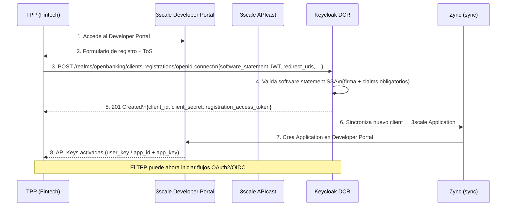
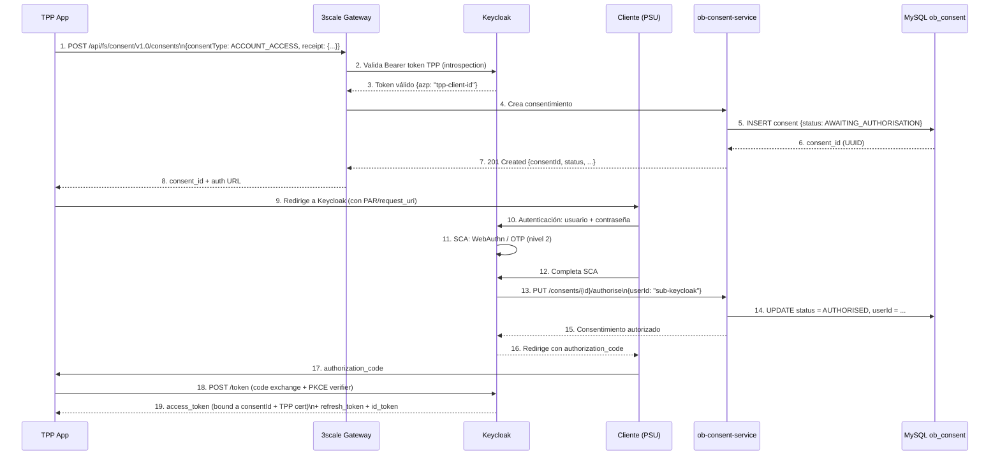
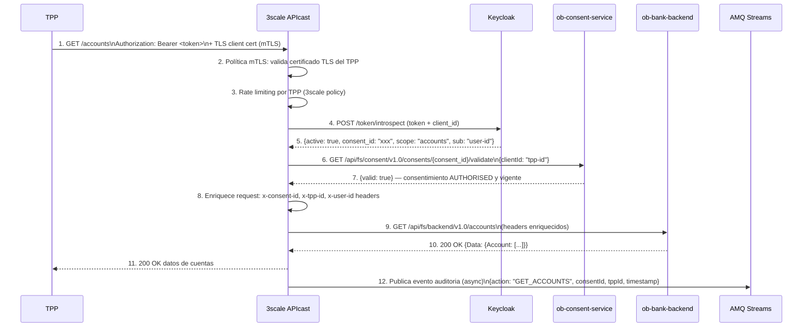
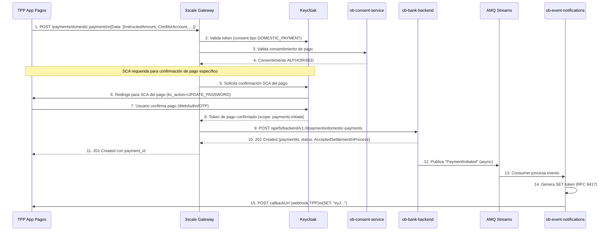
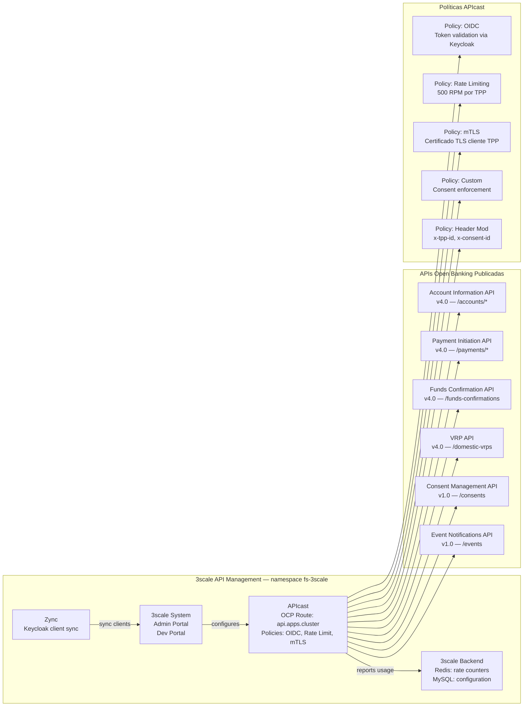
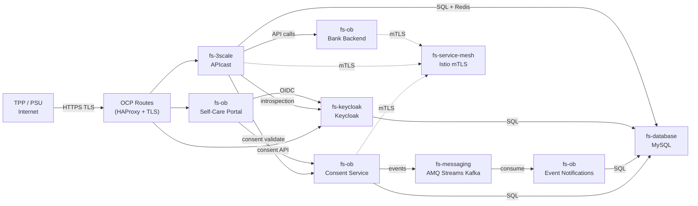

# Arquitectura de Referencia — Open Banking sobre Red Hat OpenShift

> **Versión:** 1.0.0  
> **Fecha:** 2026-06-25  
> **Plataforma objetivo:** Red Hat OpenShift Container Platform 4.14+  
> **Autor:** Juan Pablo Garzon  
> **Revisor:** Ronald Lopez  
> **Estado:** Documento de referencia técnica  

---

## Tabla de Contenidos

1. [Visión General](#1-visión-general)
2. [Implementaciones Red Hat para Open Banking](#2-implementaciones-red-hat-para-open-banking)
3. [Componentes de la Arquitectura](#3-componentes-de-la-arquitectura)
4. [Diagrama de Arquitectura Lógica](#4-diagrama-de-arquitectura-lógica)
5. [Diagrama de Flujo de Petición (Request Flow)](#5-diagrama-de-flujo-de-petición-request-flow)
6. [Diagrama de Componentes — Capa de API Management](#6-diagrama-de-componentes--capa-de-api-management)
7. [Diagrama de Componentes — Capa de Identidad y Consentimiento](#7-diagrama-de-componentes--capa-de-identidad-y-consentimiento)
8. [Arquitectura de Despliegue en OCP](#8-arquitectura-de-despliegue-en-ocp)
9. [Modelo de Datos y Bases de Datos](#9-modelo-de-datos-y-bases-de-datos)
10. [Políticas de API (3scale)](#10-políticas-de-api-3scale)
11. [Consideraciones de Seguridad y FAPI](#11-consideraciones-de-seguridad-y-fapi)
12. [Escalabilidad y Alta Disponibilidad](#12-escalabilidad-y-alta-disponibilidad)
13. [Manifiestos OCP de Referencia](#13-manifiestos-ocp-de-referencia)

---

## 1. Visión General

Esta arquitectura de referencia describe el despliegue de Open Banking / Open Finance usando exclusivamente el ecosistema **Red Hat** sobre **OpenShift Container Platform (OCP)**. Los servicios de negocio financiero (Gestión de Consentimientos, Notificaciones de Eventos, APIs de Cuentas, Pagos y VRP) son implementados como microservicios **Quarkus 3.8** nativos para la nube.

### Capacidades principales

| Capacidad | Componente Red Hat | Estándar cubierto |
|---|---|---|
| **Dynamic Client Registration (DCR)** | Keycloak 26 (nativo) | RFC 7591, FAPI 1.0 |
| **Consent Management** | ob-consent-service (Quarkus) | Open Banking UK, PSD2 |
| **Event Notifications** | ob-event-notifications (Quarkus) | RFC 8417 (SET), SSE |
| **mTLS Enforcement** | Red Hat Service Mesh (Istio) | FAPI 1.0 Advanced |
| **API Gateway** | Red Hat 3scale API Management | OAuth2, PKCE, FAPI |
| **SCA (Strong Customer Authentication)** | Keycloak Auth Flows + WebAuthn | PSD2 RTS, FAPI 2 |
| **Mock Bank APIs** | ob-bank-backend (Quarkus) | Open Banking UK v4.0 |
| **Self-Care Portal** | React SPA + nginx | — |

### Versiones de componentes

| Producto | Versión | Canal de soporte |
|---|---|---|
| Red Hat OpenShift Container Platform | 4.14 (EUS) | Red Hat |
| Red Hat 3scale API Management | 2.14 | Red Hat (Operador) |
| Keycloak (Red Hat SSO 2) | 26.x | Red Hat |
| Red Hat Service Mesh | 2.6 (Istio 1.20) | Red Hat (Operador) |
| Red Hat AMQ Streams | 2.7 (Kafka 3.7) | Red Hat (Operador) |
| Quarkus | 3.8.x (LTS) | Red Hat Build of Quarkus |
| MySQL | 8.0 (via MySQL Operator) | Community / Percona |
| Flyway | 10.x | Community |

---

## 2. Implementaciones Red Hat para Open Banking

### 2.1 Keycloak y FAPI (Financial-grade API)

Red Hat distribuye Keycloak (desde v21) con **perfiles globales de seguridad pre-configurados** para Open Banking. Estos perfiles cumplen los estándares internacionales requeridos para banca abierta:

| Perfil Global | Estándar | Capacidades incluidas |
|---|---|---|
| `fapi-1-baseline` | FAPI 1.0 Baseline | PKCE obligatorio, mTLS, redirect URI exactas |
| `fapi-1-advanced` | FAPI 1.0 Advanced | Request Objects firmados (JAR), PAR, mTLS bound tokens |
| `fapi-ciba` | FAPI CIBA | Backchannel authentication, binding_message |
| `fapi-2-security-profile` | FAPI 2 Security Profile | DPoP, PAR obligatorio, PKCE S256 |
| `oauth-2-1` | OAuth 2.1 | PKCE obligatorio, sin Implicit Flow |

**Activación en Keycloak:**
```yaml
# Realm client policy para FAPI 1.0 Advanced
{
  "name": "openbanking-fapi-policy",
  "conditions": [
    { "condition": "client-roles", "configuration": { "roles": ["openbanking-tpp"] } }
  ],
  "profiles": ["fapi-1-advanced"]
}
```

### 2.2 Keycloak y PSD2 / Open Finance Colombia

Keycloak provee nativamente:
- **DCR (Dynamic Client Registration)** — RFC 7591, RFC 7592
- **PAR (Pushed Authorization Requests)** — RFC 9126
- **DPoP** — RFC 9449 (feature `dpop` en Keycloak 24+)
- **Autenticación paso a paso (Step-Up)** — mapeado a niveles de autenticación SCA
- **WebAuthn / Passkeys** — FIDO2, W3C WebAuthn Level 3
- **CIBA (Client Initiated Backchannel Authentication)** — flujos de pago asincrónico

### 2.3 Red Hat 3scale y Open Banking

3scale API Management v2.14 incluye:
- **Policies nativas** para rate limiting por TPP, transformación de headers, validación JWT
- **Developer Portal** para onboarding self-service de TPPs con flujo de aprobación
- **Analytics** por API, por plan, por aplicación — requerido para reporte regulatorio
- **ActiveDocs (OpenAPI)** publicación del catálogo de APIs Open Banking

### 2.4 Red Hat en el ecosistema financiero global

Red Hat trabaja con bancos líderes en implementaciones de Open Banking:

| Cliente / Partner | Caso de uso | Tecnología RH |
|---|---|---|
| **Emirates NBD** | Plataforma cloud para servicios bancarios innovadores | OCP, JBoss EAP |
| **Banco Galicia** | Plataforma de IA para NLP en banca digital | OCP, Red Hat AI |
| **Finastra** | Open Finance Platform (120+ bancos globales) | OCP, 3scale |
| **Temenos** | Core bancario en contenedores | OCP, JBoss EAP |
| **ACI Worldwide** | Pagos en tiempo real (ISO 20022) | OCP, AMQ Streams |
| **Capgemini Blueprint** | Modernización bancaria (85% más rápida) | OCP, Ansible |

---

## 3. Componentes de la Arquitectura

### 3.1 Capa de API Management — Red Hat 3scale

```
financial-services-accelerator-local/open-banking-rh/
├── (integración con 3scale via admin REST API)
└── Políticas de mediación via Camel K

Componentes 3scale:
├── APIManager (operador)      # Gestión central de APIs
├── Developer Portal           # Self-service onboarding TPPs
├── API Gateway (APICast)      # Proxy Nginx con políticas OIDC
├── Backend (Redis + MySQL)    # Almacenamiento estado 3scale
└── Zync                       # Sincronización Keycloak ↔ 3scale
```

### 3.2 Capa de Identidad y Consentimiento — Keycloak + Quarkus

```
open-banking-rh/
├── ob-consent-service/        # Gestión ciclo de vida consentimientos
│   ├── ConsentResource.java   # CRUD consentimientos (JAX-RS)
│   ├── ConsentAdminResource   # Admin: búsqueda y revocación
│   ├── ConsentService.java    # Lógica de negocio (CDI)
│   ├── ConsentEntity.java     # Hibernate Panache (MySQL)
│   └── ConsentEventPublisher  # Kafka → AMQ Streams
│
├── ob-event-notifications/    # Notificaciones SET (RFC 8417)
│   ├── EventSubscriptionResource  # Suscripciones webhook TPP
│   ├── ConsentEventConsumer   # Kafka consumer
│   └── EventNotificationEntity    # Persistencia (MySQL)
│
└── Keycloak Realm "openbanking"
    ├── Authentication Flow SCA    # Password + WebAuthn/OTP
    ├── Client Policy FAPI 2       # Perfiles seguridad globales
    ├── DCR Endpoint               # Registro dinámico TPPs
    └── JWKS Endpoint              # Claves públicas para verificación
```

### 3.3 Capa de APIs de Negocio — Quarkus Backend

```
open-banking-rh/ob-bank-backend/
├── AccountResource.java       # GET /accounts, /accounts/{id}
│                              # GET /accounts/{id}/balances
│                              # GET /accounts/{id}/transactions
├── PaymentResource.java       # POST /payments/domestic-payments
│                              # GET  /payments/domestic-payments/{id}
├── FundsConfirmationResource  # POST /funds-confirmations
└── VrpResource.java           # POST/GET /domestic-vrps
```

### 3.4 Capa de Mensajería — AMQ Streams (Kafka)

```
Topics Kafka:
├── ob-consent-events          # Ciclo de vida consentimientos
│   └── payload: {eventType, consentId, clientId, userId, status}
├── ob-payment-events          # Estados de pagos
│   └── payload: {paymentId, status, accountId, amount}
└── ob-audit-events            # Trazabilidad para cumplimiento SFC
    └── payload: {action, actor, resource, timestamp, ipAddress}
```

### 3.5 Capa de Observabilidad

```
Monitoring Stack:
├── Prometheus (vía OCP Monitoring)
│   └── Métricas: APIs, JVM, DB pools, Kafka lag
├── Grafana
│   └── Dashboards: SLA regulatorio, latencia p95/p99
├── EFK Stack (Elasticsearch + Fluentd + Kibana)
│   └── Logs de auditoría (retención 5 años)
└── Jaeger (Distributed Tracing)
    └── Trazas end-to-end por correlationId FAPI
```

---

## 4. Diagrama de Arquitectura Lógica

```mermaid
graph TB
    subgraph "Actores"
        TPP[TPP / App Fintech]
        PSU[Cliente / PSU]
        ADMIN[Admin Banco]
    end

    subgraph "DMZ — OCP Routes TLS"
        INGRESS[OCP Ingress / HAProxy\nTLS Termination]
    end

    subgraph "API Management — 3scale"
        direction TB
        GW[APIcast Gateway\nOAuth2 + FAPI Policies]
        DEV_PORTAL[Developer Portal\nTPP Self-Service Onboarding]
        ADMIN_3S[Admin Portal\nAnalytics + Facturación]
        ZYNC[Zync\nKeycloak ↔ 3scale sync]
    end

    subgraph "Identidad y Consentimiento — Keycloak"
        direction TB
        KC[Keycloak 26\nRealm 'openbanking']
        
        subgraph "Keycloak Features"
            DCR_KC[DCR Endpoint\nRFC 7591]
            FAPI_POL[Client Policies FAPI 2\nPAR + DPoP + mTLS]
            SCA_FLOW[Auth Flow SCA\nPassword + WebAuthn]
            JWKS[JWKS Endpoint\nClaves públicas]
        end
        
        subgraph "Quarkus Consent"
            CONSENT_SVC[ob-consent-service\n:8081]
            CONSENT_ADM[/api/fs/consent/v1.0\n/admin/consents]
        end
        
        subgraph "Quarkus Events"
            EVENTS_SVC[ob-event-notifications\n:8082]
        end
        
        PORTAL[Self-Care Portal\nReact + nginx :80]
    end

    subgraph "APIs de Negocio — Quarkus"
        BE[ob-bank-backend\n:8083]
        subgraph "Open Banking UK v4.0"
            ACC[/accounts\n/balances\n/transactions]
            PAY[/domestic-payments\n/domestic-vrps]
            FUNDS[/funds-confirmations]
        end
    end

    subgraph "Mensajería — AMQ Streams"
        KAFKA[(Kafka\n3 brokers)]
        T_CONSENT[Topic: ob-consent-events]
        T_PAYMENT[Topic: ob-payment-events]
        T_AUDIT[Topic: ob-audit-events]
    end

    subgraph "Persistencia"
        DB_CONSENT[(MySQL\nob_consent)]
        DB_EVENTS[(MySQL\nob_events)]
        DB_KC[(MySQL\nkeycloak)]
        DB_3S[(MySQL\n3scale)]
    end

    subgraph "Observabilidad"
        OBS[Prometheus + Grafana\nEFK + Jaeger]
    end

    TPP -->|HTTPS + mTLS| INGRESS
    PSU -->|HTTPS| INGRESS
    ADMIN -->|HTTPS| INGRESS

    INGRESS --> GW
    INGRESS --> KC
    INGRESS --> PORTAL
    INGRESS --> DEV_PORTAL

    GW -->|Token introspection| KC
    GW -->|Consent validate| CONSENT_SVC
    GW -->|API calls| BE

    KC --> DCR_KC
    KC --> FAPI_POL
    KC --> SCA_FLOW
    KC --> ZYNC

    ZYNC --> ADMIN_3S

    PSU -->|OAuth2 + SCA| KC
    PSU --> PORTAL
    PORTAL -->|Consent API| CONSENT_SVC

    CONSENT_SVC --> DB_CONSENT
    CONSENT_SVC --> T_CONSENT
    EVENTS_SVC --> DB_EVENTS
    T_CONSENT --> EVENTS_SVC

    BE --> ACC
    BE --> PAY
    BE --> FUNDS
    BE --> T_PAYMENT
    BE --> T_AUDIT

    KC --> DB_KC
    GW --> DB_3S

    CONSENT_SVC -.->|métricas/logs| OBS
    GW -.->|métricas/logs| OBS
    KC -.->|métricas/logs| OBS
    BE -.->|métricas/logs| OBS
```

---

## 5. Diagrama de Flujo de Petición (Request Flow)

### 5.1 Flujo de Registro de TPP (DCR — Dynamic Client Registration)



### 5.2 Flujo de Consentimiento del Cliente (OAuth2 + SCA)



### 5.3 Flujo de Llamada a API Protegida (Cuentas)



### 5.4 Flujo de Iniciación de Pago (Domestic Payment)



---

## 6. Diagrama de Componentes — Capa de API Management



---

## 7. Diagrama de Componentes — Capa de Identidad y Consentimiento

```mermaid
graph TB
    subgraph "Keycloak — namespace fs-keycloak"
        direction TB
        KC_REALM[Realm: openbanking]
        
        subgraph "Clients registrados"
            C_3SCALE[3scale-sync\nService Account]
            C_PORTAL[self-care-portal\nPublic OIDC Client]
            C_TPPs[TPPs dinámicos\nDCR registrados]
        end
        
        subgraph "Authentication Flows"
            AF_BROWSER[browser-ob\nCookie → ID-First → Password → SCA]
            AF_DCR[first-broker-login\nOnboarding TPP]
            AF_SCA[sca-payment\nPassword + WebAuthn (FAPI 2)]
        end
        
        subgraph "Client Policies FAPI"
            CP_FAPI2[Policy: fapi-2-open-banking\nCondition: client-roles=openbanking-tpp\nProfile: fapi-2-security-profile]
            CP_OAUTH21[Policy: oauth-2-1\nCondition: any-client\nProfile: oauth-2-1]
        end
        
        KC_REALM --> C_3SCALE
        KC_REALM --> C_PORTAL
        KC_REALM --> C_TPPs
        KC_REALM --> AF_BROWSER
        KC_REALM --> AF_DCR
        KC_REALM --> AF_SCA
        KC_REALM --> CP_FAPI2
        KC_REALM --> CP_OAUTH21
    end

    subgraph "ob-consent-service — namespace fs-ob"
        direction TB
        CS_API[ConsentResource\nPOST/GET/DELETE /consents]
        CS_ADM[ConsentAdminResource\nGET /admin/consents]
        CS_VAL[GET /consents/{id}/validate\nusado por 3scale policy]
        CS_AUTH[PUT /consents/{id}/authorise\nusado por Keycloak flow]
        CS_SVC[ConsentService\nBusiness logic CDI]
        CS_ENT[ConsentEntity\nPanache — MySQL]
        CS_EVT[ConsentEventPublisher\nKafka emitter]

        CS_API --> CS_SVC
        CS_ADM --> CS_SVC
        CS_VAL --> CS_SVC
        CS_AUTH --> CS_SVC
        CS_SVC --> CS_ENT
        CS_SVC --> CS_EVT
    end

    subgraph "ob-event-notifications — namespace fs-ob"
        ES_API[EventSubscriptionResource\nCRUD /subscription]
        ES_CONS[ConsentEventConsumer\nKafka listener]
        ES_ENT[EventNotificationEntity\nPanache — MySQL]

        ES_CONS --> ES_ENT
        ES_API --> ES_ENT
    end

    KC_REALM -->|introspection| CS_VAL
    KC_REALM -->|authorise consent| CS_AUTH
    CS_EVT -->|ob-consent-events| ES_CONS
```

---

## 8. Arquitectura de Despliegue en OCP

```
Red Hat OpenShift Container Platform 4.14
│
├── Namespace: fs-3scale                     [API Management]
│   ├── APIManager CR (3scale-operator)
│   ├── Deployment: apicast-production        (3 réplicas)
│   ├── Deployment: apicast-staging           (1 réplica)
│   ├── Deployment: system-app               (2 réplicas)
│   ├── Deployment: zync                     (2 réplicas)
│   ├── Deployment: backend-worker           (2 réplicas)
│   ├── PVC: mysql-storage                   (50Gi — RWO)
│   ├── PVC: redis-storage                   (10Gi — RWO)
│   ├── Route: api.apps.<domain>             (HTTPS — APIs externas TPP)
│   ├── Route: admin.apps.<domain>           (HTTPS — Admin Portal)
│   └── Route: developer.apps.<domain>       (HTTPS — Dev Portal TPPs)
│
├── Namespace: fs-keycloak                   [Identidad]
│   ├── Keycloak CR (keycloak-operator)
│   ├── Deployment: keycloak                 (3 réplicas — HA cluster)
│   ├── PVC: keycloak-data                   (20Gi — RWO)
│   ├── Route: auth.apps.<domain>            (HTTPS — OIDC endpoints)
│   └── Secret: keycloak-db-secret
│
├── Namespace: fs-ob                         [Open Banking Services]
│   ├── Deployment: ob-consent-service       (2 réplicas)
│   │   ├── Port: 8081
│   │   ├── Env: DB_HOST, KEYCLOAK_HOST, KAFKA_BOOTSTRAP
│   │   ├── ConfigMap: consent-config
│   │   └── Secret: consent-db-secret
│   ├── Deployment: ob-event-notifications   (2 réplicas)
│   │   ├── Port: 8082
│   │   └── Secret: events-db-secret
│   ├── Deployment: ob-bank-backend          (2 réplicas)
│   │   └── Port: 8083
│   ├── Deployment: self-care-portal         (2 réplicas — nginx)
│   │   └── Port: 80
│   ├── Service: ob-consent-svc              (ClusterIP)
│   ├── Service: ob-events-svc               (ClusterIP)
│   ├── Service: ob-backend-svc              (ClusterIP)
│   ├── Service: portal-svc                  (ClusterIP)
│   └── Route: portal.apps.<domain>          (HTTPS — Self-Care Portal)
│
├── Namespace: fs-messaging                  [Mensajería]
│   ├── Kafka CR (amq-streams-operator)
│   │   ├── Kafka: 3 brokers (3 réplicas)
│   │   ├── ZooKeeper: 3 réplicas
│   │   └── PVC: kafka-data-* (50Gi por broker)
│   ├── KafkaTopic: ob-consent-events        (3 particiones, replica 2)
│   ├── KafkaTopic: ob-payment-events        (3 particiones, replica 2)
│   └── KafkaTopic: ob-audit-events          (6 particiones, replica 3)
│
├── Namespace: fs-database                   [Persistencia]
│   ├── StatefulSet: mysql                   (3 nodos — InnoDB Cluster)
│   ├── PVC: mysql-data-* (100Gi por nodo)
│   └── Service: mysql-svc                   (ClusterIP)
│
├── Namespace: fs-service-mesh              [Seguridad mTLS]
│   ├── ServiceMeshControlPlane (istio-operator)
│   ├── ServiceMeshMemberRoll: [fs-ob, fs-3scale, fs-keycloak]
│   ├── PeerAuthentication: STRICT (mTLS entre pods)
│   └── AuthorizationPolicy: allow-inbound-tpp
│
└── Namespace: openshift-monitoring         [Observabilidad]
    ├── Prometheus (OCP stack)
    ├── Grafana (Community Operator)
    ├── Elasticsearch + Fluentd + Kibana     (EFK Stack)
    └── Jaeger (Red Hat Service Mesh)
```

**Diagrama de comunicación entre namespaces:**



---

## 9. Modelo de Datos y Bases de Datos

### 9.1 Base de datos ob_consent (Flyway V1)

```sql
-- Tabla principal de consentimientos
CREATE TABLE ob_consent (
    consent_id           VARCHAR(36)   NOT NULL,  -- UUID
    client_id            VARCHAR(255)  NOT NULL,  -- TPP client_id (Keycloak)
    user_id              VARCHAR(255),             -- Subject del cliente (post-auth)
    consent_type         VARCHAR(50)   NOT NULL,  -- ACCOUNT_ACCESS | DOMESTIC_PAYMENT | ...
    status               VARCHAR(30)   NOT NULL,  -- AWAITING_AUTHORISATION | AUTHORISED | ...
    receipt              TEXT          NOT NULL,  -- JSON payload completo del consentimiento
    created_timestamp    DATETIME(6)   NOT NULL,
    updated_timestamp    DATETIME(6)   NOT NULL,
    expiration_timestamp DATETIME(6),              -- NULL = no expira
    consent_attributes   TEXT,                     -- JSON metadata adicional (permissions, etc.)
    PRIMARY KEY (consent_id),
    INDEX idx_consent_client  (client_id),
    INDEX idx_consent_user    (user_id),
    INDEX idx_consent_status  (status),
    INDEX idx_consent_type    (consent_type)
) ENGINE=InnoDB DEFAULT CHARSET=utf8mb4;
```

### 9.2 Base de datos ob_events (Flyway V1)

```sql
-- Suscripciones webhook de TPPs para recibir eventos
CREATE TABLE ob_event_subscription (
    subscription_id   VARCHAR(36)   NOT NULL,
    client_id         VARCHAR(255)  NOT NULL,  -- TPP que se suscribe
    callback_url      VARCHAR(1024),            -- Webhook URL del TPP
    event_types       TEXT,                     -- JSON array de tipos de eventos
    version           VARCHAR(20),
    created_timestamp DATETIME(6)   NOT NULL,
    PRIMARY KEY (subscription_id),
    INDEX idx_sub_client (client_id)
) ENGINE=InnoDB DEFAULT CHARSET=utf8mb4;

-- Notificaciones pendientes de entrega (SET tokens RFC 8417)
CREATE TABLE ob_event_notification (
    notification_id   VARCHAR(36)  NOT NULL,
    client_id         VARCHAR(255) NOT NULL,
    set_payload       TEXT         NOT NULL,  -- JWT Security Event Token
    status            VARCHAR(20)  NOT NULL DEFAULT 'OPEN',  -- OPEN | DELIVERED
    created_timestamp DATETIME(6)  NOT NULL,
    PRIMARY KEY (notification_id),
    INDEX idx_notif_client (client_id),
    INDEX idx_notif_status (status)
) ENGINE=InnoDB DEFAULT CHARSET=utf8mb4;
```

### 9.3 Bases de datos requeridas

| Base de datos | Propósito | Tamaño estimado inicial |
|---|---|---|
| `ob_consent` | Consentimientos Open Banking | 10 GB |
| `ob_events` | Subscripciones y notificaciones | 5 GB |
| `keycloak` | Usuarios, clients, sesiones, tokens | 20 GB |
| `3scale_production` | APIs, plans, metrics, apps 3scale | 10 GB |

---

## 10. Políticas de API (3scale)

### 10.1 Política OIDC — Validación de Tokens Keycloak

```yaml
# APIcast Policy: OIDC
- name: oidc
  version: builtin
  configuration:
    issuer: "https://auth.apps.cluster.example.com/realms/openbanking"
    client_id: "3scale-sync"
    # Keycloak JWKS endpoint para verificación de firma JWT
    jwks_url: "https://auth.apps.cluster.example.com/realms/openbanking/protocol/openid-connect/certs"
    # Scopes requeridos por API
    required_scopes:
      - accounts:read        # Account Information API
      - payments:initiate    # Payment Initiation API
      - funds-confirmation   # Funds Confirmation API
```

### 10.2 Política Rate Limiting por TPP

```yaml
# APIcast Policy: Rate Limiting
- name: rate_limit
  version: builtin
  configuration:
    limits:
      - condition: "jwt.claim.azp"   # client_id del TPP desde JWT
        operations:
          - left: "200"              # 200 req/min por TPP
            left_type: fixed
            op: ">="
            right: "{{http_requests_per_minute}}"
            right_type: liquid
        actions:
          - type: reject
            status: 429
            headers:
              Retry-After: "60"
              Content-Type: "application/json"
```

### 10.3 Política Consent Enforcement (Custom Camel K)

```java
// Ruta Camel K: ConsentEnforcementRoute.java
// Valida que el access_token tiene un consentimiento AUTHORISED asociado
@ApplicationScoped
public class ConsentEnforcementRoute extends RouteBuilder {
    @Override
    public void configure() {
        // Intercepta cada request entrante desde APIcast
        from("direct:consent-enforcement")
            .process(exchange -> {
                String consentId = exchange.getIn()
                    .getHeader("x-consent-id", String.class);
                String clientId  = exchange.getIn()
                    .getHeader("x-tpp-id", String.class);

                // Llama al ob-consent-service para validar
                String url = "http://ob-consent-svc.fs-ob:8081"
                           + "/api/fs/consent/v1.0/consents/"
                           + consentId + "/validate?clientId=" + clientId;

                exchange.getIn().setHeader(Exchange.HTTP_URI, url);
            })
            .toD("http://ob-consent-svc.fs-ob:8081?bridgeEndpoint=true")
            .choice()
                .when(header("CamelHttpResponseCode").isNotEqualTo(200))
                    .setHeader(Exchange.HTTP_RESPONSE_CODE, constant(403))
                    .setBody(constant("{\"error\":\"consent_invalid\"}"))
                    .stop()
            .end();
    }
}
```

### 10.4 Planes de API (3scale Tiers)

| Plan | Límite llamadas | Aplicación |
|---|---|---|
| `sandbox` | 100 req/día | Desarrollo y testing TPPs |
| `basic` | 10,000 req/día | TPPs autorizados (sandbox regulatorio) |
| `production` | 100,000 req/día | TPPs con certificado regulatorio activo |
| `premium` | Sin límite | Entidades financieras asociadas |

---

## 11. Consideraciones de Seguridad y FAPI

### 11.1 Perfiles FAPI implementados por Keycloak

Red Hat incluye en Keycloak 26 los siguientes perfiles listos para producción:

```
Global Client Profiles (pre-configurados):
├── fapi-1-baseline
│   ├── Executor: pkce-enforcer (S256 obligatorio)
│   ├── Executor: secure-redirect-uris (sin wildcards, HTTPS)
│   └── Executor: secure-session (duración limitada)
│
├── fapi-1-advanced
│   ├── Executor: pkce-enforcer
│   ├── Executor: mtls-enforcer (mTLS bound tokens)
│   ├── Executor: request-object-enforcer (JAR firmado)
│   └── Executor: par-enforcer (PAR obligatorio)
│
└── fapi-2-security-profile
    ├── Executor: pkce-enforcer (S256)
    ├── Executor: par-enforcer (PAR obligatorio)
    ├── Executor: dpop-enforcer (DPoP tokens)
    └── Executor: prohibit-implicit-grant (sin Implicit Flow)
```

### 11.2 Controles de seguridad por capa

| Capa | Control | Implementación |
|---|---|---|
| **Perímetro** | TLS 1.3 obligatorio | OCP HAProxy + Routes |
| **API Gateway** | mTLS TPP ↔ 3scale | 3scale APIcast Policy |
| **Identidad** | FAPI 2 + DPoP | Keycloak Client Policy |
| **Consentimiento** | Validación en cada request | ob-consent-service validate |
| **Inter-servicios** | mTLS entre pods | Red Hat Service Mesh STRICT |
| **Datos en tránsito** | TLS en MySQL | MySQL SSL config |
| **Datos en reposo** | etcd cifrado OCP + MySQL TDE | OCP config |
| **Secretos** | OCP Secrets + etcd cifrado | OCP Secret API |
| **Auditoría** | Logs inmutables 5 años | EFK + AMQ Streams audit topic |
| **Escaneo** | CVE continuo en imágenes | Red Hat ACS (Advanced Cluster Security) |

### 11.3 Configuración SCA en Keycloak (Authentication Flow)

```yaml
# Browser Authentication Flow Open Banking con SCA
# Equivalente al PSD2 RTS Strong Customer Authentication
Authentication Flow: browser-ob
│
├── Cookie (ALTERNATIVE)         # SSO session válida → skip
├── Identity-First Login (REQUIRED)
│   └── Username Form
└── SCA Sub-flow (CONDITIONAL)
    ├── Condition: Credential Configured
    └── Authenticators (ALTERNATIVE):
        ├── OTP Form                    # Factor 2: TOTP (Google Auth / FreeOTP)
        └── WebAuthn Authenticator      # Factor 2: FIDO2 (Passkey / Yubikey)

# Para pagos: flujo de SCA nivel 2 (LoA = 2)
Client Policy FAPI 2:
  - Condition: Grant Type = authorization_code
  - Condition: Scope = payments:initiate
  - Action: require-acr-values = [loa-2]  # Fuerza SCA
```

---

## 12. Escalabilidad y Alta Disponibilidad

### 12.1 SLA y objetivos de disponibilidad

| Servicio | SLA | RPO | RTO | Réplicas mínimas |
|---|---|---|---|---|
| 3scale APIcast (Gateway) | 99.9% | 15 min | 30 min | 3 |
| Keycloak | 99.9% | 15 min | 30 min | 3 |
| ob-consent-service | 99.5% | 1 hora | 30 min | 2 |
| ob-event-notifications | 99.5% | 1 hora | 1 hora | 2 |
| ob-bank-backend | 99.5% | N/A (stateless) | 5 min | 2 |
| MySQL InnoDB Cluster | 99.9% | 5 min | 15 min | 3 |
| AMQ Streams (Kafka) | 99.9% | 1 min | 5 min | 3 brokers |

### 12.2 Horizontal Pod Autoscaler para servicios Quarkus

```yaml
# HPA — ob-consent-service
apiVersion: autoscaling/v2
kind: HorizontalPodAutoscaler
metadata:
  name: ob-consent-service-hpa
  namespace: fs-ob
spec:
  scaleTargetRef:
    apiVersion: apps/v1
    kind: Deployment
    name: ob-consent-service
  minReplicas: 2
  maxReplicas: 8
  metrics:
  - type: Resource
    resource:
      name: cpu
      target:
        type: Utilization
        averageUtilization: 70
  - type: Resource
    resource:
      name: memory
      target:
        type: Utilization
        averageUtilization: 80
  behavior:
    scaleUp:
      stabilizationWindowSeconds: 30
      policies:
      - type: Pods
        value: 2
        periodSeconds: 60
    scaleDown:
      stabilizationWindowSeconds: 300
```

### 12.3 Alta disponibilidad de Keycloak (Infinispan distributed cache)

```yaml
# Keycloak CR — HA con cache distribuida
apiVersion: k8s.keycloak.org/v2alpha1
kind: Keycloak
metadata:
  name: keycloak-openbanking
  namespace: fs-keycloak
spec:
  instances: 3
  db:
    vendor: mysql
    host: mysql-svc.fs-database
    database: keycloak
    usernameSecret:
      name: keycloak-db-secret
      key: username
    passwordSecret:
      name: keycloak-db-secret
      key: password
  http:
    tlsSecret: keycloak-tls-secret
  hostname:
    hostname: auth.apps.cluster.example.com
  cache:
    # Infinispan distribuido entre réplicas (JGroups KUBE_PING)
    configMapFile:
      name: keycloak-cache-config
      key: cache-ispn.xml
  resources:
    requests:
      memory: "512Mi"
      cpu: "500m"
    limits:
      memory: "1Gi"
      cpu: "2"
```

### 12.4 Estrategia de despliegue GitOps (ArgoCD)

```yaml
# Application ArgoCD — Open Banking Services
apiVersion: argoproj.io/v1alpha1
kind: Application
metadata:
  name: open-banking-rh
  namespace: openshift-gitops
spec:
  project: financial-services
  source:
    repoURL: https://github.com/garzontaleroj/financial-services-accelerator-local
    targetRevision: main
    path: open-banking-rh/deploy/overlays/production
  destination:
    server: https://kubernetes.default.svc
    namespace: fs-ob
  syncPolicy:
    automated:
      prune: true
      selfHeal: true
    syncOptions:
    - CreateNamespace=true
    - ApplyOutOfSyncOnly=true
```

---

## 13. Manifiestos OCP de Referencia

### 13.1 Deployment — ob-consent-service

```yaml
apiVersion: apps/v1
kind: Deployment
metadata:
  name: ob-consent-service
  namespace: fs-ob
  labels:
    app: ob-consent-service
    version: "1.0.0"
    app.kubernetes.io/part-of: open-banking-rh
spec:
  replicas: 2
  selector:
    matchLabels:
      app: ob-consent-service
  template:
    metadata:
      labels:
        app: ob-consent-service
        version: "1.0.0"
      annotations:
        sidecar.istio.io/inject: "true"     # Service Mesh mTLS
    spec:
      serviceAccountName: ob-consent-sa
      containers:
      - name: ob-consent-service
        image: quay.io/openbanking-rh/ob-consent-service:1.0.0
        imagePullPolicy: Always
        ports:
        - containerPort: 8081
          name: http
        env:
        - name: QUARKUS_DATASOURCE_JDBC_URL
          value: "jdbc:mysql://mysql-svc.fs-database:3306/ob_consent?useSSL=true"
        - name: QUARKUS_DATASOURCE_USERNAME
          valueFrom:
            secretKeyRef:
              name: consent-db-secret
              key: username
        - name: QUARKUS_DATASOURCE_PASSWORD
          valueFrom:
            secretKeyRef:
              name: consent-db-secret
              key: password
        - name: QUARKUS_OIDC_AUTH_SERVER_URL
          value: "https://auth.apps.cluster.example.com/realms/openbanking"
        - name: KAFKA_BOOTSTRAP_SERVERS
          value: "ob-kafka-kafka-bootstrap.fs-messaging:9092"
        resources:
          requests:
            memory: "64Mi"
            cpu: "100m"
          limits:
            memory: "256Mi"
            cpu: "500m"
        readinessProbe:
          httpGet:
            path: /q/health/ready
            port: 8081
          initialDelaySeconds: 15
          periodSeconds: 10
        livenessProbe:
          httpGet:
            path: /q/health/live
            port: 8081
          initialDelaySeconds: 30
          periodSeconds: 20
        securityContext:
          runAsNonRoot: true
          readOnlyRootFilesystem: true
          allowPrivilegeEscalation: false
          capabilities:
            drop: ["ALL"]
```

### 13.2 Service + Route — ob-consent-service

```yaml
---
apiVersion: v1
kind: Service
metadata:
  name: ob-consent-svc
  namespace: fs-ob
spec:
  selector:
    app: ob-consent-service
  ports:
  - port: 8081
    targetPort: 8081
    name: http
---
# Route expuesta solo internamente (sin acceso desde internet)
# El acceso externo es SOLO a través de 3scale APIcast
apiVersion: route.openshift.io/v1
kind: Route
metadata:
  name: ob-consent-internal
  namespace: fs-ob
  annotations:
    haproxy.router.openshift.io/ip_whitelist: "10.0.0.0/8"  # Solo red interna
spec:
  host: consent-internal.apps.cluster.example.com
  to:
    kind: Service
    name: ob-consent-svc
  tls:
    termination: edge
    insecureEdgeTerminationPolicy: Redirect
```

### 13.3 NetworkPolicy — aislamiento entre namespaces

```yaml
# Solo 3scale y Keycloak pueden llamar a los servicios Quarkus
apiVersion: networking.k8s.io/v1
kind: NetworkPolicy
metadata:
  name: allow-apicast-and-keycloak
  namespace: fs-ob
spec:
  podSelector:
    matchLabels:
      app.kubernetes.io/part-of: open-banking-rh
  policyTypes:
  - Ingress
  ingress:
  - from:
    - namespaceSelector:
        matchLabels:
          name: fs-3scale      # 3scale APIcast
    - namespaceSelector:
        matchLabels:
          name: fs-keycloak    # Keycloak auth flows
    - namespaceSelector:
        matchLabels:
          name: fs-service-mesh  # Istio sidecar
    ports:
    - port: 8081   # ob-consent-service
    - port: 8082   # ob-event-notifications
    - port: 8083   # ob-bank-backend
    - port: 80     # self-care-portal
```

### 13.4 KafkaTopic — ob-consent-events

```yaml
apiVersion: kafka.strimzi.io/v1beta2
kind: KafkaTopic
metadata:
  name: ob-consent-events
  namespace: fs-messaging
  labels:
    strimzi.io/cluster: ob-kafka
spec:
  partitions: 3
  replicas: 2
  config:
    retention.ms: 604800000        # 7 días
    segment.bytes: 1073741824      # 1 GB por segmento
    cleanup.policy: delete
    min.insync.replicas: "2"       # Mínimo 2 réplicas in-sync
```

---

## Referencias y recursos adicionales

### Red Hat — Documentación oficial Open Banking / FAPI

| Recurso | URL |
|---|---|
| Keycloak FAPI Support | https://www.keycloak.org/docs/latest/securing_apps/index.html#_fapi-support |
| 3scale API Management | https://access.redhat.com/documentation/en-us/red_hat_3scale_api_management |
| Red Hat Service Mesh | https://docs.openshift.com/container-platform/latest/service_mesh/v2x/ossm-about.html |
| Quarkus OIDC | https://quarkus.io/guides/security-oidc-code-flow-authentication |
| AMQ Streams (Kafka) | https://access.redhat.com/documentation/en-us/red_hat_amq_streams |
| Red Hat Financial Services | https://www.redhat.com/en/solutions/financial-services |

### Estándares Open Banking implementados

| Estándar | Organismo | Implementación |
|---|---|---|
| Open Banking UK v4.0 | OBIE | ob-bank-backend (API contracts) |
| FAPI 1.0 Advanced | OpenID Foundation | Keycloak Client Policies |
| FAPI 2.0 Security Profile | OpenID Foundation | Keycloak Client Policies |
| RFC 7591/7592 (DCR) | IETF | Keycloak nativo |
| RFC 9126 (PAR) | IETF | Keycloak nativo |
| RFC 9449 (DPoP) | IETF | Keycloak (feature dpop) |
| RFC 8417 (SET) | IETF | ob-event-notifications |
| PSD2 RTS (SCA) | EBA | Keycloak Auth Flows WebAuthn |
| ISO 20022 | ISO | Payload de pagos (ob-bank-backend) |

---

*Documento generado el 2026-06-25. Próxima revisión: 2026-07-27.*  
*Contacto técnico: Juan Pablo Garzon — Ticxar / Red Hat Financial Services LAM.*
