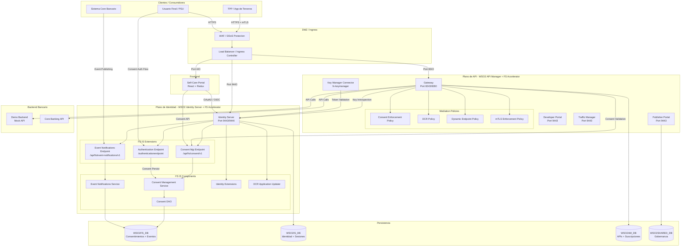
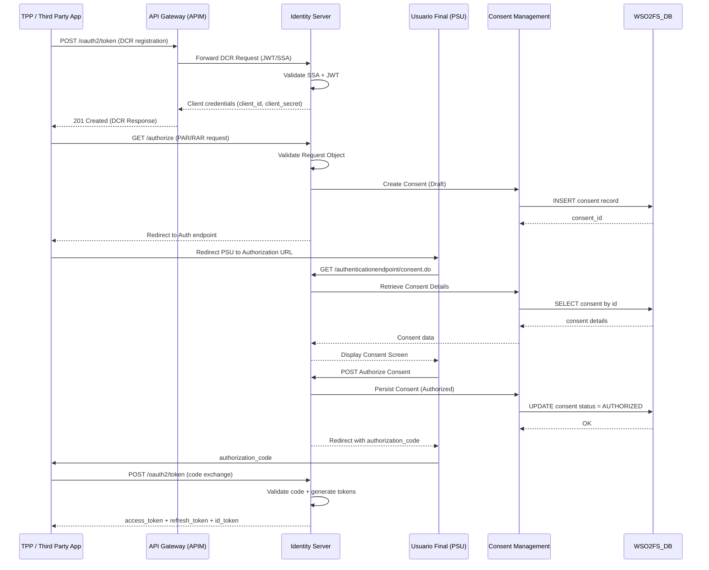
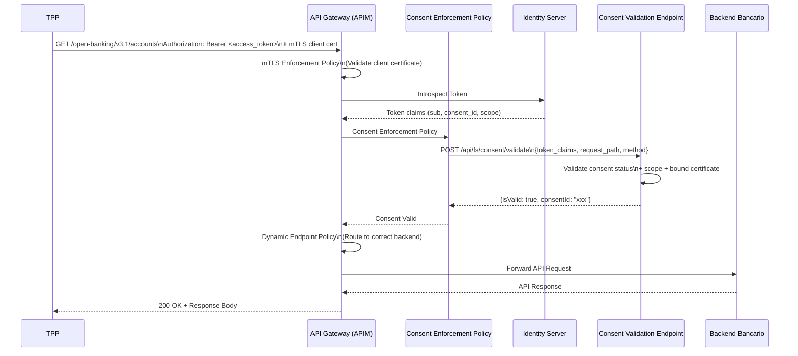
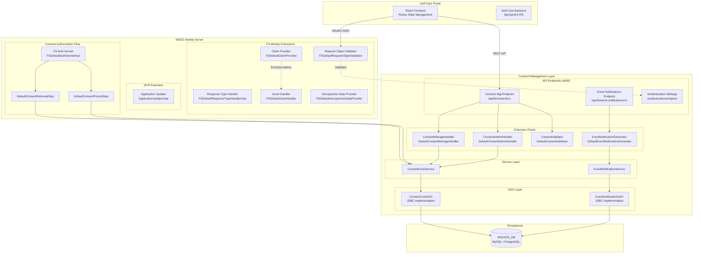
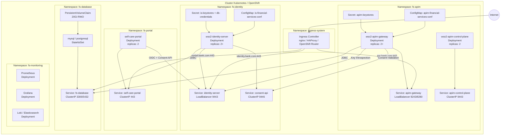
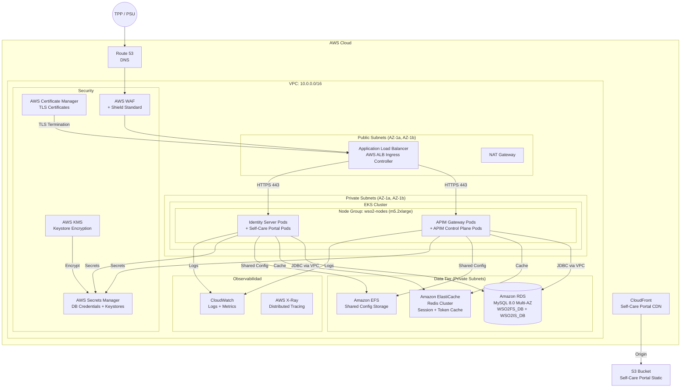
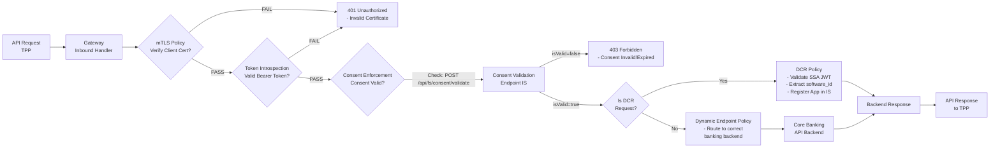
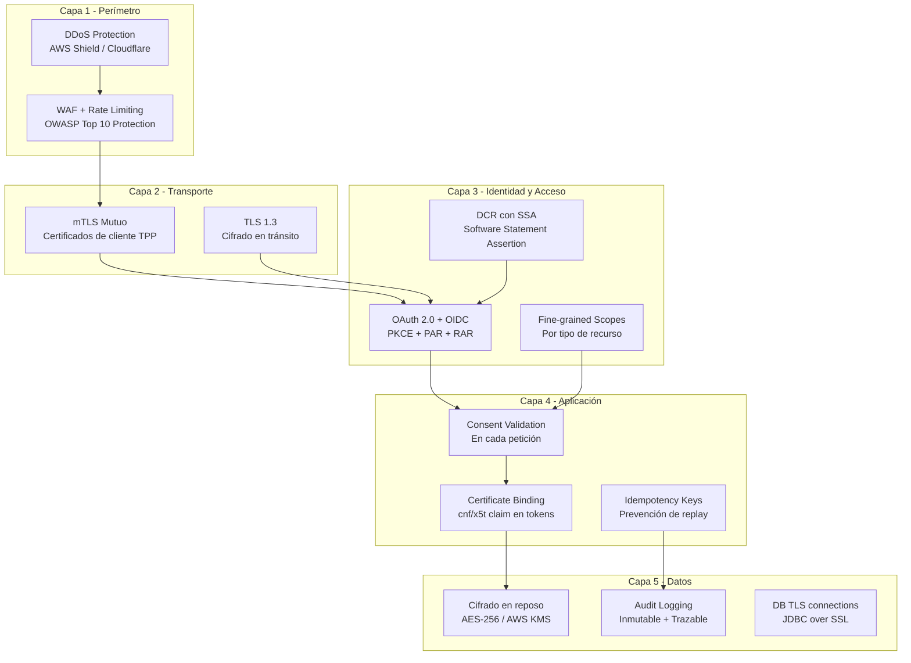
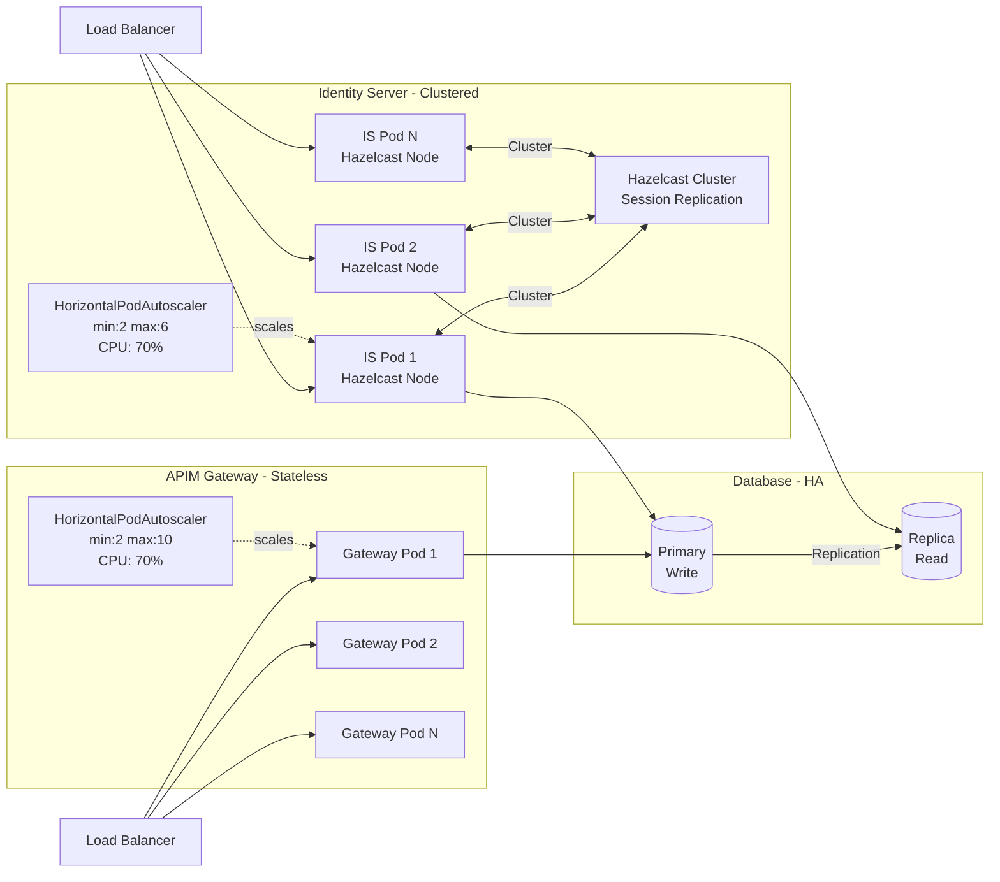

# WSO2 Financial Services Accelerator — Arquitectura de Referencia

> **Versión:** 4.0.0  
> **Fecha:** 2026-06-25  
> **Plataformas objetivo:** OpenShift · Kubernetes · AWS (EKS)

---

## Tabla de Contenidos

1. [Visión General](#1-visión-general)
2. [Componentes del Acelerador](#2-componentes-del-acelerador)
3. [Diagrama de Arquitectura Lógica](#3-diagrama-de-arquitectura-lógica)
4. [Diagrama de Flujo de Petición (Request Flow)](#4-diagrama-de-flujo-de-petición-request-flow)
5. [Diagrama de Componentes — Capa de Gateway](#5-diagrama-de-componentes--capa-de-gateway)
6. [Diagrama de Componentes — Capa de Identidad y Consentimiento](#6-diagrama-de-componentes--capa-de-identidad-y-consentimiento)
7. [Arquitectura de Despliegue en Kubernetes / OpenShift](#7-arquitectura-de-despliegue-en-kubernetes--openshift)
8. [Arquitectura de Despliegue en AWS (EKS)](#8-arquitectura-de-despliegue-en-aws-eks)
9. [Modelo de Datos y Bases de Datos](#9-modelo-de-datos-y-bases-de-datos)
10. [Políticas de Mediación](#10-políticas-de-mediación)
11. [Consideraciones de Seguridad](#11-consideraciones-de-seguridad)
12. [Escalabilidad y Alta Disponibilidad](#12-escalabilidad-y-alta-disponibilidad)
13. [Manifiestos Kubernetes de Referencia](#13-manifiestos-kubernetes-de-referencia)

---

## 1. Visión General

El **WSO2 Financial Services Accelerator** es un conjunto de tecnologías que acelera la adopción de cumplimiento normativo para la banca abierta (Open Banking). Está construido sobre dos productos WSO2:

| Producto Base | Acelerador FS | Puerto por Defecto |
|---|---|---|
| WSO2 API Manager 4.x | `wso2-fsam-accelerator-4.0.0` | 8243 (Gateway), 9443 (Publisher/DevPortal) |
| WSO2 Identity Server 7.x | `wso2-fsiam-accelerator-4.0.0` | 9443, 9446 |

### Capacidades Principales

- **Dynamic Client Registration (DCR)** — Registro dinámico de clientes TPP con validación de JWT/SSA
- **Consent Management** — Ciclo de vida completo de consentimientos (creación, autorización, validación, revocación)
- **Event Notifications** — Notificaciones asíncronas de eventos financieros (SET/CAEP)
- **mTLS Enforcement** — Aplicación de certificados de transporte mutuos
- **Self-Care Portal** — Portal React para gestión de consentimientos por parte del usuario final

---

## 2. Componentes del Acelerador

### 2.1 Módulos Java (OSGi Bundles)

```
financial-services-accelerator/components/
├── org.wso2.financial.services.accelerator.common          # Utilidades comunes, JDBC, caché
├── org.wso2.financial.services.accelerator.consent.mgt.dao      # Capa de acceso a datos de consentimientos
├── org.wso2.financial.services.accelerator.consent.mgt.service  # Lógica de negocio de consentimientos
├── org.wso2.financial.services.accelerator.consent.mgt.extensions # Extensiones (handlers, validators, steps)
├── org.wso2.financial.services.accelerator.event.notifications.service # Servicio de notificaciones de eventos
├── org.wso2.financial.services.accelerator.gateway         # Ejecutores del gateway (request router, executors)
├── org.wso2.financial.services.accelerator.identity.extensions # Extensiones de identidad (claims, grants, DCR)
└── org.wso2.financial.services.accelerator.keymanager      # Integración con Key Manager de APIM
```

### 2.2 WebApps Internas (WAR)

```
financial-services-accelerator/internal-webapps/
├── org.wso2.financial.services.accelerator.authentication.endpoint  # Endpoint de autenticación/consentimiento
├── org.wso2.financial.services.accelerator.consent.mgt.endpoint     # API REST de gestión de consentimientos
├── org.wso2.financial.services.accelerator.demo.backend             # Backend de demostración (mock bancario)
└── org.wso2.financial.services.accelerator.event.notifications.endpoint # API REST de notificaciones de eventos
```

### 2.3 Políticas de Mediación (Synapse/API Gateway)

```
financial-services-accelerator/common-mediation-policies/
├── consent-enforcement/        # Valida consentimientos en cada llamada a la API
├── dynamic-client-registration/ # Maneja flujo DCR en el gateway
├── dynamic-endpoint/           # Enrutamiento dinámico de endpoints bancarios
└── mtls-enforcement/           # Valida certificados de transporte mTLS
```

### 2.4 Aplicaciones Frontend

```
financial-services-accelerator/react-apps/
└── self-care-portal/           # Portal React (Redux) — Gestión de consentimientos para usuarios finales
```

### 2.5 Aceleradores de Producto

```
financial-services-accelerator/accelerators/
├── fs-apim/   # Artefactos, configuración y scripts para WSO2 API Manager
└── fs-is/     # Artefactos, configuración y scripts para WSO2 Identity Server
```

---

## 3. Diagrama de Arquitectura Lógica



---

## 4. Diagrama de Flujo de Petición (Request Flow)

### 4.1 Flujo de Autorización de Consentimiento (OAuth2 / OIDC)



### 4.2 Flujo de Llamada a API Protegida



---

## 5. Diagrama de Componentes — Capa de Gateway

```mermaid
graph LR
    subgraph "WSO2 API Manager Gateway"
        REQ[Inbound Request] --> SYNAPSE[Synapse Engine]

        subgraph "FS Gateway Executors"
            ROUTER[DefaultRequestRouter]
            EXEC1[DCR Executor]
            EXEC2[Consent Enforcement Executor]
            EXEC3[mTLS Executor]
            EXEC4[Custom Executor\nExtensible]
        end

        SYNAPSE --> ROUTER
        ROUTER --> EXEC1
        ROUTER --> EXEC2
        ROUTER --> EXEC3
        ROUTER --> EXEC4

        subgraph "Mediation Policies (Synapse XML)"
            MP1[consent-enforcement.xml]
            MP2[dynamic-client-registration.xml]
            MP3[dynamic-endpoint.xml]
            MP4[mtls-enforcement.xml]
        end

        EXEC2 --> MP1
        EXEC1 --> MP2
        MP3 --> BE_ROUTE[Backend Route]
        EXEC3 --> MP4
    end

    subgraph "Key Manager Extension"
        KM[fs-keymanager\nOSGi Bundle]
        KM --> IS_KM[IS Key Manager API\n/api/am/admin/v3/key-managers]
    end

    EXEC2 -->|Validate| CONSENT_API[/api/fs/consent/validate\nIS Consent Endpoint]
    EXEC1 -->|Register App| DCR_API[/keymanager-operations/dcr/register\nIS DCR Endpoint]
```

---

## 6. Diagrama de Componentes — Capa de Identidad y Consentimiento



---

## 7. Arquitectura de Despliegue en Kubernetes / OpenShift

### 7.1 Diagrama de Infraestructura



### 7.2 Topología de Red y Puertos

| Servicio | Namespace | Puerto Interno | Puerto Externo | Protocolo |
|---|---|---|---|---|
| APIM Gateway | fs-apim | 8243 | 443 (via Ingress TLS) | HTTPS + mTLS |
| APIM Gateway (passthrough) | fs-apim | 8280 | 80 | HTTP |
| APIM Control Plane | fs-apim | 9443 | N/A (interno) | HTTPS |
| Identity Server | fs-identity | 9443 | 443 (via Ingress TLS) | HTTPS |
| Consent API | fs-identity | 9446 | N/A (interno) | HTTPS |
| Self-Care Portal | fs-portal | 443 | 443 (via Ingress TLS) | HTTPS |
| MySQL/PostgreSQL | fs-database | 3306/5432 | N/A | TCP |

---

## 8. Arquitectura de Despliegue en AWS (EKS)



### 8.1 Recursos AWS Recomendados

| Recurso | Tipo / SKU | Justificación |
|---|---|---|
| EKS Node Group (APIM) | `m5.2xlarge` (2+ nodos) | 8 vCPU, 32 GB RAM por nodo |
| EKS Node Group (IS) | `m5.xlarge` (2+ nodos) | 4 vCPU, 16 GB RAM por nodo |
| RDS MySQL | `db.r6g.xlarge` Multi-AZ | Alta disponibilidad para FS_DB |
| ElastiCache Redis | `cache.r6g.large` cluster | Token cache + sesiones |
| EFS | `General Purpose` | Configuraciones compartidas entre pods |
| ALB | Application Load Balancer | TLS termination + path routing |
| ACM | Wildcard Certificate | `*.bank.com` |

---

## 9. Modelo de Datos y Bases de Datos

```mermaid
erDiagram
    FS_CONSENT {
        string CONSENT_ID PK
        string RECEIPT
        string CLIENT_ID
        string CONSENT_TYPE
        int CURRENT_STATUS
        string APPLICANT_ID
        datetime CREATED_TIME
        datetime UPDATED_TIME
        int VALIDITY_PERIOD
        bool IS_RECURRING
        int RECURRING_FREQUENCY
    }

    FS_CONSENT_ATTRIBUTE {
        string CONSENT_ID FK
        string ATT_KEY
        string ATT_VALUE
    }

    FS_CONSENT_RESOURCE {
        string CONSENT_ID FK
        string RESOURCE_PATH
        string RESOURCE_OPERATION
    }

    FS_CONSENT_MAPPING {
        string MAPPING_ID PK
        string CONSENT_ID FK
        string ACCOUNT_ID
        string PERMISSION
        string MAPPING_STATUS
    }

    FS_CONSENT_AUTH_RESOURCE {
        string AUTH_ID PK
        string CONSENT_ID FK
        string AUTH_TYPE
        string USER_ID
        int AUTH_STATUS
        datetime UPDATED_TIME
    }

    FS_CONSENT_STATUS_AUDIT {
        int STATUS_AUDIT_ID PK
        string CONSENT_ID FK
        string CURRENT_STATUS
        datetime ACTION_TIME
        string ACTION_BY
        string REASON
    }

    NOTIFICATION {
        string NOTIFICATION_ID PK
        string CLIENT_ID
        string RESOURCE_ID
        string RESOURCE_TYPE
        string RESOURCE_ENDPOINT_PUBLISH_STATUS
        int PRIORITY
        datetime UPDATED_TIME
    }

    NOTIFICATION_EVENT {
        string EVENT_ID PK
        string NOTIFICATION_ID FK
        string EVENT_INFORMATION
    }

    NOTIFICATION_ERROR {
        string NOTIFICATION_ID PK_FK
        string ERROR_CODE
        string ERROR_DESCRIPTION
        string ERROR_URI
    }

    FS_CONSENT ||--o{ FS_CONSENT_ATTRIBUTE : "has"
    FS_CONSENT ||--o{ FS_CONSENT_RESOURCE : "has"
    FS_CONSENT ||--o{ FS_CONSENT_MAPPING : "maps to"
    FS_CONSENT ||--o{ FS_CONSENT_AUTH_RESOURCE : "authorizes"
    FS_CONSENT ||--o{ FS_CONSENT_STATUS_AUDIT : "audits"
    NOTIFICATION ||--o{ NOTIFICATION_EVENT : "contains"
    NOTIFICATION ||--o| NOTIFICATION_ERROR : "may have"
```

### Bases de Datos Requeridas

| Base de Datos | Propósito | Motor Recomendado |
|---|---|---|
| `WSO2FS_DB` | Consentimientos + Event Notifications | MySQL 8.0 / PostgreSQL 14+ |
| `WSO2IS_DB` | Identidades, sesiones, tokens OAuth2 | MySQL 8.0 / PostgreSQL 14+ |
| `WSO2AM_DB` | APIs, suscripciones, aplicaciones | MySQL 8.0 / PostgreSQL 14+ |
| `WSO2SHARED_DB` | Gobernanza compartida IS + APIM | MySQL 8.0 / PostgreSQL 14+ |

---

## 10. Políticas de Mediación



---

## 11. Consideraciones de Seguridad

### 11.1 Modelo de Seguridad en Capas



### 11.2 Checklist de Seguridad para Producción

| Ítem | Estado | Descripción |
|---|---|---|
| mTLS en Gateway | Obligatorio | Todos los TPPs deben presentar certificado de cliente |
| TLS 1.2+ mínimo | Obligatorio | Deshabilitar TLS 1.0/1.1 y SSLv3 |
| Rotación de keystores | Obligatorio | JKS/P12 en Kubernetes Secrets o HSM |
| Contraseñas en Secrets | Obligatorio | No hardcodear en ConfigMaps |
| Network Policies | Obligatorio | Microsegmentación entre namespaces |
| Pod Security Standards | Obligatorio | `restricted` en namespaces productivos |
| RBAC mínimo | Obligatorio | ServiceAccounts con permisos mínimos |
| Audit Logging IS | Obligatorio | Habilitar `audit.log` en IS |
| WAF Rules OWASP | Recomendado | Reglas para SQLi, XSS, injection |
| Secrets Manager | Recomendado | AWS Secrets Manager / HashiCorp Vault |

---

## 12. Escalabilidad y Alta Disponibilidad

### 12.1 Estrategia de Escalado



### 12.2 Recursos por Pod (Sizing de Referencia)

| Componente | CPU Request | CPU Limit | Memory Request | Memory Limit | Min Replicas |
|---|---|---|---|---|---|
| APIM Gateway | 1000m | 2000m | 2Gi | 4Gi | 2 |
| APIM Control Plane | 1000m | 2000m | 2Gi | 4Gi | 2 |
| Identity Server | 1000m | 2000m | 2Gi | 4Gi | 2 |
| Self-Care Portal | 200m | 500m | 256Mi | 512Mi | 2 |
| MySQL (StatefulSet) | 1000m | 2000m | 2Gi | 4Gi | 1 (+ replica) |

---

## 13. Manifiestos Kubernetes de Referencia

> Los siguientes manifiestos son de referencia. Adaptar valores de imagen, namespace y configuración al entorno específico.

### 13.1 Namespace y ResourceQuota

```yaml
# namespace-fs.yaml
apiVersion: v1
kind: Namespace
metadata:
  name: fs-identity
  labels:
    app.kubernetes.io/part-of: financial-services
    pod-security.kubernetes.io/enforce: restricted
---
apiVersion: v1
kind: Namespace
metadata:
  name: fs-apim
  labels:
    app.kubernetes.io/part-of: financial-services
    pod-security.kubernetes.io/enforce: restricted
---
apiVersion: v1
kind: ResourceQuota
metadata:
  name: fs-identity-quota
  namespace: fs-identity
spec:
  hard:
    requests.cpu: "4"
    requests.memory: 8Gi
    limits.cpu: "8"
    limits.memory: 16Gi
    pods: "20"
```

### 13.2 ConfigMap — Financial Services (Identity Server)

```yaml
# configmap-is-financial-services.yaml
apiVersion: v1
kind: ConfigMap
metadata:
  name: is-financial-services-conf
  namespace: fs-identity
data:
  financial-services.xml: |
    <?xml version="1.0" encoding="UTF-8"?>
    <Server xmlns="http://wso2.org/projects/carbon/financial-services.xml">
        <JDBCPersistenceManager>
            <DataSource>
                <Name>jdbc/WSO2FS_DB</Name>
            </DataSource>
        </JDBCPersistenceManager>
        <Consent>
            <ManageHandler>
                org.wso2.financial.services.accelerator.consent.mgt.extensions.manage.impl.DefaultConsentManageHandler
            </ManageHandler>
            <AuthorizeSteps>
                <Retrieve>
                    <Step class="org.wso2.financial.services.accelerator.consent.mgt.extensions.authorize.impl.DefaultConsentRetrievalStep" priority="1"/>
                </Retrieve>
                <Persist>
                    <Step class="org.wso2.financial.services.accelerator.consent.mgt.extensions.authorize.impl.DefaultConsentPersistStep" priority="1"/>
                </Persist>
            </AuthorizeSteps>
            <Validation>
                <Validator>
                    org.wso2.financial.services.accelerator.consent.mgt.extensions.validate.impl.DefaultConsentValidator
                </Validator>
                <JWTPayloadValidation>true</JWTPayloadValidation>
            </Validation>
            <Portal>
                <Params>
                    <IdentityServerBaseUrl>https://identity.bank.com</IdentityServerBaseUrl>
                    <ApiManagerServerBaseUrl>https://api.bank.com</ApiManagerServerBaseUrl>
                </Params>
            </Portal>
        </Consent>
        <Identity>
            <Extensions>
                <RequestObjectValidator>
                    org.wso2.financial.services.accelerator.identity.extensions.auth.extensions.request.validator.DefaultFSRequestObjectValidator
                </RequestObjectValidator>
                <ClaimProvider>
                    org.wso2.financial.services.accelerator.identity.extensions.claims.FSDefaultClaimProvider
                </ClaimProvider>
                <GrantHandler>
                    org.wso2.financial.services.accelerator.identity.extensions.grant.type.handlers.FSDefaultGrantHandler
                </GrantHandler>
            </Extensions>
        </Identity>
        <EventNotifications>
            <NotificationGeneration>
                <NotificationGenerator>
                    org.wso2.financial.services.accelerator.event.notifications.service.DefaultEventNotificationGenerator
                </NotificationGenerator>
                <NumberOfSetsToReturn>5</NumberOfSetsToReturn>
            </NotificationGeneration>
        </EventNotifications>
    </Server>
```

### 13.3 Secret — Credenciales de Base de Datos

```yaml
# secret-db-credentials.yaml
apiVersion: v1
kind: Secret
metadata:
  name: db-credentials
  namespace: fs-identity
type: Opaque
stringData:
  db-url: "jdbc:mysql://fs-database.fs-database.svc.cluster.local:3306/WSO2FS_DB?useSSL=true"
  db-username: "wso2fsuser"
  db-password: "<CHANGE_ME_USE_SEALED_SECRETS_OR_VAULT>"
```

### 13.4 Deployment — WSO2 Identity Server

```yaml
# deployment-identity-server.yaml
apiVersion: apps/v1
kind: Deployment
metadata:
  name: wso2-identity-server
  namespace: fs-identity
  labels:
    app: wso2-identity-server
    app.kubernetes.io/component: identity
    app.kubernetes.io/part-of: financial-services
spec:
  replicas: 2
  selector:
    matchLabels:
      app: wso2-identity-server
  strategy:
    rollingUpdate:
      maxSurge: 1
      maxUnavailable: 0
    type: RollingUpdate
  template:
    metadata:
      labels:
        app: wso2-identity-server
    spec:
      affinity:
        podAntiAffinity:
          requiredDuringSchedulingIgnoredDuringExecution:
            - labelSelector:
                matchExpressions:
                  - key: app
                    operator: In
                    values:
                      - wso2-identity-server
              topologyKey: kubernetes.io/hostname
      containers:
        - name: wso2is
          image: wso2/wso2is:7.0.0  # Customizar con imagen que incluya FS accelerator
          imagePullPolicy: Always
          ports:
            - containerPort: 9443
              name: https
            - containerPort: 9446
              name: consent-api
          resources:
            requests:
              memory: "2Gi"
              cpu: "1000m"
            limits:
              memory: "4Gi"
              cpu: "2000m"
          env:
            - name: WSO2_FS_DB_URL
              valueFrom:
                secretKeyRef:
                  name: db-credentials
                  key: db-url
            - name: WSO2_FS_DB_USER
              valueFrom:
                secretKeyRef:
                  name: db-credentials
                  key: db-username
            - name: WSO2_FS_DB_PASSWORD
              valueFrom:
                secretKeyRef:
                  name: db-credentials
                  key: db-password
          volumeMounts:
            - name: financial-services-conf
              mountPath: /home/wso2carbon/wso2-config-volume/repository/conf/financial-services.xml
              subPath: financial-services.xml
            - name: keystores
              mountPath: /home/wso2carbon/wso2-config-volume/repository/resources/security
              readOnly: true
          livenessProbe:
            exec:
              command:
                - /bin/sh
                - -c
                - nc -z localhost 9443
            initialDelaySeconds: 120
            periodSeconds: 30
            failureThreshold: 3
          readinessProbe:
            exec:
              command:
                - /bin/sh
                - -c
                - curl -k -s https://localhost:9443/carbon/
            initialDelaySeconds: 90
            periodSeconds: 15
            failureThreshold: 3
      volumes:
        - name: financial-services-conf
          configMap:
            name: is-financial-services-conf
        - name: keystores
          secret:
            secretName: is-keystores
      securityContext:
        runAsNonRoot: true
        runAsUser: 802
        fsGroup: 802
```

### 13.5 Service — Identity Server

```yaml
# service-identity-server.yaml
apiVersion: v1
kind: Service
metadata:
  name: identity-server
  namespace: fs-identity
  labels:
    app: wso2-identity-server
spec:
  type: ClusterIP
  selector:
    app: wso2-identity-server
  ports:
    - name: https
      port: 9443
      targetPort: 9443
    - name: consent-api
      port: 9446
      targetPort: 9446
---
apiVersion: v1
kind: Service
metadata:
  name: identity-server-lb
  namespace: fs-identity
  annotations:
    # AWS: service.beta.kubernetes.io/aws-load-balancer-type: "nlb"
    # OpenShift: route.openshift.io/termination: "passthrough"
spec:
  type: LoadBalancer
  selector:
    app: wso2-identity-server
  ports:
    - name: https
      port: 443
      targetPort: 9443
```

### 13.6 HorizontalPodAutoscaler

```yaml
# hpa-identity-server.yaml
apiVersion: autoscaling/v2
kind: HorizontalPodAutoscaler
metadata:
  name: wso2-identity-server-hpa
  namespace: fs-identity
spec:
  scaleTargetRef:
    apiVersion: apps/v1
    kind: Deployment
    name: wso2-identity-server
  minReplicas: 2
  maxReplicas: 6
  metrics:
    - type: Resource
      resource:
        name: cpu
        target:
          type: Utilization
          averageUtilization: 70
    - type: Resource
      resource:
        name: memory
        target:
          type: Utilization
          averageUtilization: 75
```

### 13.7 NetworkPolicy — Microsegmentación

```yaml
# networkpolicy-fs-identity.yaml
apiVersion: networking.k8s.io/v1
kind: NetworkPolicy
metadata:
  name: fs-identity-netpol
  namespace: fs-identity
spec:
  podSelector:
    matchLabels:
      app: wso2-identity-server
  policyTypes:
    - Ingress
    - Egress
  ingress:
    # Permitir desde Ingress Controller
    - from:
        - namespaceSelector:
            matchLabels:
              kubernetes.io/metadata.name: ingress-system
      ports:
        - port: 9443
    # Permitir desde APIM Gateway (consent validation + token introspection)
    - from:
        - namespaceSelector:
            matchLabels:
              kubernetes.io/metadata.name: fs-apim
      ports:
        - port: 9443
        - port: 9446
    # Permitir desde Self-Care Portal
    - from:
        - namespaceSelector:
            matchLabels:
              kubernetes.io/metadata.name: fs-portal
      ports:
        - port: 9443
        - port: 9446
  egress:
    # Permitir a base de datos
    - to:
        - namespaceSelector:
            matchLabels:
              kubernetes.io/metadata.name: fs-database
      ports:
        - port: 3306
        - port: 5432
    # Permitir DNS
    - to:
        - namespaceSelector: {}
      ports:
        - port: 53
          protocol: UDP
```

### 13.8 Ingress — TLS Termination

```yaml
# ingress-financial-services.yaml
apiVersion: networking.k8s.io/v1
kind: Ingress
metadata:
  name: financial-services-ingress
  namespace: fs-identity
  annotations:
    nginx.ingress.kubernetes.io/backend-protocol: "HTTPS"
    nginx.ingress.kubernetes.io/ssl-passthrough: "true"
    # Para mTLS en APIM Gateway usar passthrough o configurar en APIM
spec:
  ingressClassName: nginx
  tls:
    - hosts:
        - identity.bank.com
      secretName: identity-bank-tls
  rules:
    - host: identity.bank.com
      http:
        paths:
          - path: /
            pathType: Prefix
            backend:
              service:
                name: identity-server
                port:
                  number: 9443
---
apiVersion: networking.k8s.io/v1
kind: Ingress
metadata:
  name: apim-ingress
  namespace: fs-apim
  annotations:
    nginx.ingress.kubernetes.io/backend-protocol: "HTTPS"
    nginx.ingress.kubernetes.io/ssl-passthrough: "true"
spec:
  ingressClassName: nginx
  tls:
    - hosts:
        - api.bank.com
      secretName: api-bank-tls
  rules:
    - host: api.bank.com
      http:
        paths:
          - path: /
            pathType: Prefix
            backend:
              service:
                name: apim-gateway
                port:
                  number: 8243
```

---

## Apéndice A — Variables de Entorno Clave

| Variable | Componente | Descripción |
|---|---|---|
| `WSO2_FS_DB_URL` | IS, APIM | JDBC URL para WSO2FS_DB |
| `WSO2_IS_DB_URL` | IS | JDBC URL para WSO2IS_DB |
| `WSO2_AM_DB_URL` | APIM | JDBC URL para WSO2AM_DB |
| `CARBON_HOME` | IS, APIM | Directorio raíz del servidor WSO2 |
| `JAVA_OPTS` | IS, APIM | `-Xms2g -Xmx4g -XX:+UseG1GC` |

## Apéndice B — Imágenes Docker Recomendadas

```
# Base Images (customizar con artefactos FS)
wso2/wso2am:4.3.0           -> + fs-apim accelerator artifacts
wso2/wso2is:7.0.0            -> + fs-is accelerator artifacts
mysql:8.0                    -> WSO2FS_DB, WSO2IS_DB, WSO2AM_DB
node:20-alpine               -> Self-Care Portal build
```

## Apéndice C — Puertos y Endpoints de Referencia

| Endpoint | Descripción |
|---|---|
| `https://identity.bank.com/oauth2/token` | Token endpoint (OAuth2) |
| `https://identity.bank.com/oauth2/authorize` | Authorization endpoint |
| `https://identity.bank.com/api/fs/consent/v1` | Consent Management API |
| `https://identity.bank.com/api/fs/event-notifications/v1` | Event Notifications API |
| `https://identity.bank.com/keymanager-operations/dcr/register` | DCR endpoint |
| `https://api.bank.com/open-banking/v3.1/` | Open Banking APIs (via APIM Gateway) |
| `https://portal.bank.com` | Self-Care Portal (React) |
